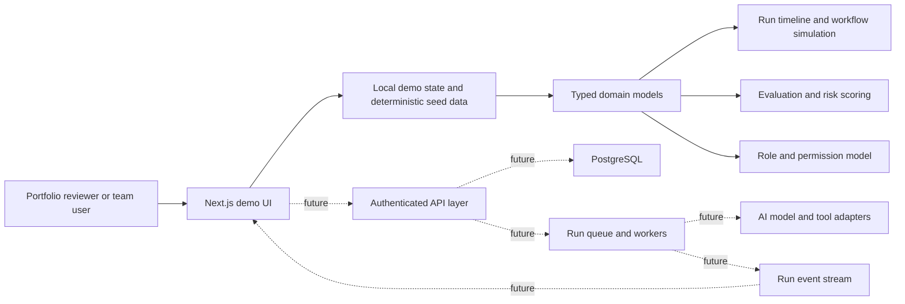
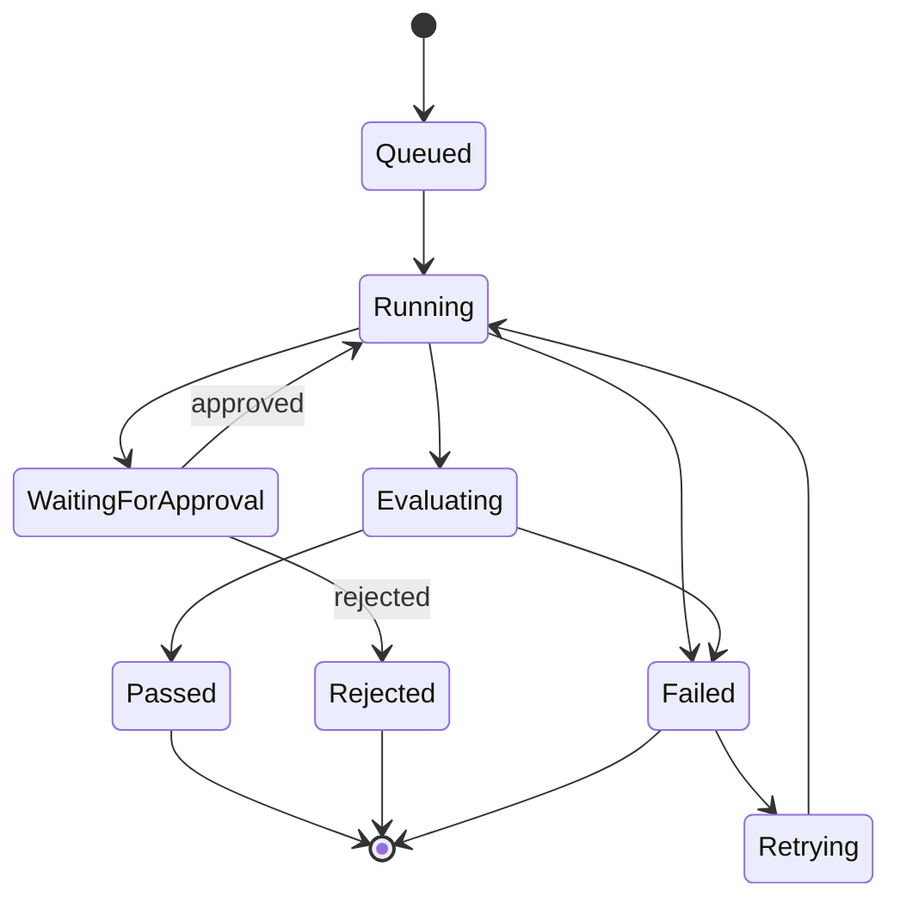
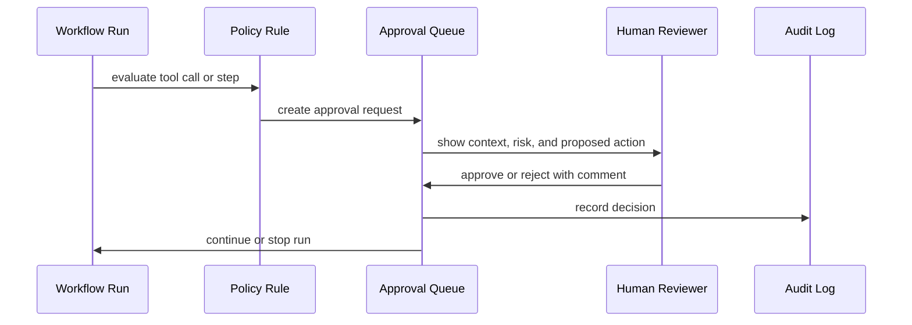

# Architecture

## Architecture Goal

AgentOps Command Center should begin as a deterministic local demo and grow toward a real enterprise AI operations platform without changing the core domain language. The architecture favors a modular monolith for early phases, clear bounded contexts, typed domain models, and a future path to authenticated APIs, PostgreSQL, queues, workers, and live run updates.

## High-Level Architecture



## Phase 1 Architecture

Phase 1 is documentation only:

- No app scaffold.
- No package installation.
- No runtime dependencies.
- No external accounts.
- No secrets or environment files.
- All product and architecture assumptions are documented before implementation.

## Recommended Future Application Shape

```txt
app/
  (demo)/
    dashboard/
    agents/
    workflows/
    runs/
    approvals/
    evaluations/
    risks/
    browser-qa/
    audit/
    settings/
src/
  domain/
    entities.ts
    enums.ts
    permissions.ts
  data/
    seed-projects.ts
    seed-agents.ts
    seed-runs.ts
  components/
    layout/
    dashboard/
    runs/
    approvals/
    tables/
  lib/
    filters.ts
    formatters.ts
    risk-scoring.ts
    run-simulation.ts
```

## Bounded Contexts

| Context | Responsibility |
| --- | --- |
| Identity and RBAC | Users, teams, roles, permissions, environment boundaries, approval authority. |
| Agent Registry | Agent definitions, capabilities, owners, risk level, status, and operational metrics. |
| Workflow Design | Workflow metadata, steps, dependencies, retry rules, tool requirements, approval checkpoints. |
| Run Operations | Workflow runs, run events, tool calls, status transitions, failure replay, trace IDs. |
| Approvals | Approval requests, decisions, comments, escalation, expiration, and audit records. |
| Evaluation | Run scoring, evaluator notes, pass/fail thresholds, release gate inputs. |
| Risk and Security | Risk findings, severity, policy rule mapping, remediation status, security review queues. |
| Browser QA | Browser sessions, steps, screenshots, console/network/accessibility notes. |
| Cost Analytics | Token usage, model usage, estimated cost, budget alerts, cost per run. |
| Audit | Immutable record of high-risk actions, permission changes, workflow changes, and approvals. |

## Frontend Architecture

The future UI should use:

- Next.js App Router for routes and layouts.
- TypeScript for domain model safety.
- Tailwind CSS for token-driven layout and spacing.
- shadcn/ui-style component architecture for accessible primitives and consistent composition.
- Deterministic local seed data before any backend.
- Role switcher state to demonstrate permissions without real auth.
- Query/filter utilities that can later map to API query params.

The first app shell should include:

- Persistent sidebar navigation.
- Project switcher area, initially single-project.
- Role switcher for portfolio exploration.
- Dashboard summary cards.
- Tables with filters, empty states, and row detail links.
- Timeline component for run events.
- Approval queue components with disabled states for unauthorized roles.

## Future Backend Architecture

Early backend recommendation: modular monolith.

Why:

- The project is early-stage and portfolio-focused.
- Domain boundaries are known but not proven by production load.
- One codebase keeps API contracts, auth, RBAC, audit, and database changes coherent.
- The system can still use queues and workers without splitting into microservices.

Future backend components:

- API server or Next.js route handlers.
- Auth/session provider.
- RBAC middleware and policy engine.
- PostgreSQL data store.
- Queue for workflow runs and background evaluation.
- Worker process for run execution.
- Event publisher for live timeline updates.
- Object storage for browser screenshots and exported reports.
- Audit writer with append-only guarantees.

## Future Database Architecture

PostgreSQL is the preferred future database because the system needs relational consistency, indexes, audit trails, and strong querying across runs, agents, workflows, approvals, risks, and teams.

Key database principles:

- Use stable IDs for every domain entity.
- Store immutable run events instead of only mutating run status.
- Keep approval decisions and audit records append-only.
- Represent secrets as references, never secret values.
- Index status, severity, project, workflow, timestamps, and assignee fields.
- Model environment boundaries explicitly.

## Workflow Run Lifecycle



## Approval Lifecycle



## Evaluation Lifecycle

1. A workflow run reaches an evaluation checkpoint.
2. Evaluation categories are scored with deterministic mock values in early phases.
3. Scores are mapped to release gate thresholds.
4. Low scores create findings or warnings.
5. Results are stored with evaluator notes, version, and evidence links.
6. The dashboard rolls results up by project, workflow, agent, and time period.

## Risk Lifecycle

1. A risk signal is emitted by a run event, tool call, browser QA issue, or evaluation result.
2. The system creates a `RiskFinding` with severity, category, evidence, owner, and remediation status.
3. Role-based queues show the finding to Security Reviewer, QA Reviewer, Product Manager, or Admin depending on category.
4. Resolution requires a comment and audit record.
5. Release gates use unresolved high/critical risks as blockers.

## Browser QA Lifecycle

1. A workflow run triggers or links to a browser QA session.
2. The session records deterministic demo steps in early phases.
3. Each step stores action, expected result, observed result, status, and notes.
4. Console, network, screenshot, and accessibility placeholders are attached.
5. Failed sessions create release gate blockers and risk findings when relevant.

## Audit Logging Lifecycle

Audit records should be created for:

- Role or permission changes.
- Agent configuration changes.
- Workflow publish/update/archive events.
- Approval decisions.
- Rejected risky actions.
- Release gate overrides.
- Secret reference changes.
- Environment boundary changes.

Audit records should include actor, action, target, before/after summary, timestamp, IP/device metadata when available, and correlation ID.

## Error Handling Strategy

- Distinguish user-facing errors from internal diagnostics.
- Use explicit run event types for failures.
- Keep retryable and non-retryable failure reasons separate.
- Never hide approval failures inside generic run failures.
- Show enough evidence for a reviewer to understand what failed.
- In future backend phases, add structured error codes and request IDs.

## Scalability Strategy

Phase 1 and demo phases use local deterministic data. Future scale path:

- Paginate high-volume lists such as run events, tool calls, audit logs, and cost metrics.
- Use indexes for project/status/severity/created-at queries.
- Move slow run execution into queues.
- Stream run events to the UI instead of polling everything.
- Store browser screenshots outside the relational database.
- Aggregate cost and evaluation metrics for dashboard cards.
- Use retention policies for raw logs while preserving audit-critical records.

## Rejected Alternatives

| Alternative | Reason Rejected For Early Phases |
| --- | --- |
| Microservices from day one | Adds infrastructure and coordination cost before the domain is proven. |
| Real AI API integration in Phase 1 | Violates the docs-only scope and would distract from architecture foundations. |
| Live browser automation in Phase 1 | Useful later, but browser QA needs a UI and run model first. |
| Auth provider setup now | No app scaffold exists yet; RBAC can be designed without connecting accounts. |
| Production deployment now | Premature before a working app and quality gates. |

## Architecture Acceptance Criteria

- Every core module maps to a domain context.
- Runs, approvals, risks, evaluations, and audit logs are connected by IDs and trace/correlation fields.
- The demo can be implemented with deterministic mock data.
- Future backend boundaries are clear.
- Security controls are part of the model, not an afterthought.
