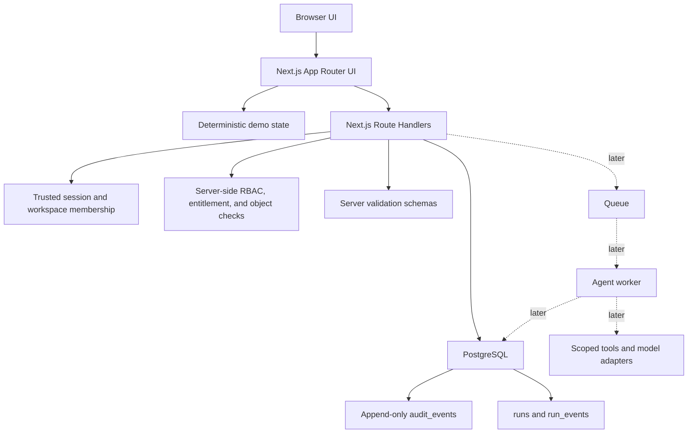

# Backend Implementation Plan

Phase 4A is an architecture and implementation plan only. It does not implement backend code, authentication, a database, billing, external APIs, AI providers, workers, secrets, deployments, or UI changes.

## 1. Executive summary

AgentOps Command Center should move from deterministic frontend prototype to real full-stack platform through a staged hybrid architecture.

Recommended direction:

- Keep the current Next.js App Router frontend and deterministic demo mode.
- Add backend modules gradually with Next.js Route Handlers first.
- Use PostgreSQL as the persistence layer.
- Use a TypeScript-first ORM or query builder, with Drizzle as the preferred first choice and Prisma as the acceptable alternative if the team values Prisma Studio and generated client conventions more.
- Use Zod-style server validation before every database operation.
- Add real authentication and workspace membership before trusting any role.
- Enforce RBAC, object access, plan limits, and built-in agent entitlements on the server.
- Persist audit events, approvals, run events, risks, evaluations, usage records, and entitlement state before enabling live AI agents.
- Add queue/worker execution only after the persistence, RBAC, audit, and approval foundations are working.

The current app remains valuable as the deterministic public demo. The backend path should preserve that mode so portfolio review stays free, repeatable, and safe while production foundations are added behind it.

Primary implementation principle:

```text
Client UI shows product state.
Backend decides identity, authorization, entitlements, sensitive reads, sensitive writes, usage, and audit.
Workers execute future agent tasks only through scoped, policy-checked tools.
```

## 2. Official security standards reviewed

The plan uses these sources as guidance, not as a claim of certification or full compliance:

| Source | Practical rule for AgentOps |
| --- | --- |
| [OWASP ASVS](https://owasp.org/www-project-application-security-verification-standard/) | Define security requirements for auth, sessions, access control, validation, error handling, logging, data protection, and configuration before implementation. |
| [OWASP Web Security Testing Guide](https://owasp.org/www-project-web-security-testing-guide/) | Turn the architecture into repeatable security tests for identity, auth, authorization, sessions, input validation, API behavior, client behavior, and error handling. |
| [OWASP API Security Project](https://owasp.org/www-project-api-security/) and [API Top 10 2023](https://owasp.org/API-Security/editions/2023/en/0x11-t10/) | Prioritize object-level authorization, function-level authorization, authentication, excessive data exposure, resource consumption controls, and safe API consumption. |
| [OWASP Top 10 for LLM Applications](https://owasp.org/www-project-top-10-for-large-language-model-applications/) and [OWASP GenAI LLM Top 10](https://genai.owasp.org/llm-top-10/) | Treat prompt injection, sensitive information disclosure, excessive agency, insecure output handling, model/tool abuse, supply chain risk, and resource exhaustion as first-class architecture concerns. |
| [NIST AI Risk Management Framework](https://www.nist.gov/itl/ai-risk-management-framework) | Govern AI features through documented risk identification, measurement, oversight, limitations, and human review. |
| [NIST Cybersecurity Framework 2.0](https://www.nist.gov/cyberframework) | Organize backend hardening around Govern, Identify, Protect, Detect, Respond, and Recover. |
| [MITRE ATLAS](https://atlas.mitre.org/) | Model AI-enabled threats, tool misuse, prompt/tool abuse, model supply chain issues, and runtime monitoring around known AI threat patterns. |
| [MITRE CWE Top 25](https://cwe.mitre.org/top25/) | Keep XSS, SQL injection, CSRF, missing authorization, unsafe deserialization, path traversal, SSRF-adjacent weaknesses, and validation failures in the verification checklist. |

Security wording used throughout this plan:

- Hardened, not "hacking-proof."
- Defense-in-depth, not a single magic control.
- Server-side authorization, not client-side role trust.
- Injection-resistant, not injection-impossible.
- Audit-first, fail-closed, rate-limited, observable, transaction-safe, and testable.

## 3. Reference repo lessons reviewed

Reference projects were reviewed for patterns only. No code should be copied or imported.

| Reference | Useful lesson | Do not copy |
| --- | --- | --- |
| [openai/codex-plugin-cc](https://github.com/openai/codex-plugin-cc) | Read-only review modes, background task status/cancel/result flows, explicit tool boundaries, and local configuration boundaries are useful for future agent operations. | Do not delegate AgentOps authorization to a plugin or treat local plugin permissions as production security. |
| [yamadashy/repomix](https://github.com/yamadashy/repomix) | LLM context packaging needs filtering, redaction, deterministic output, and clear exclusion rules. | Do not pack secrets, private files, or unrestricted customer data into model context. |
| [vercel-labs/agent-browser](https://github.com/vercel-labs/agent-browser) | Browser automation should be a bounded tool with explicit targets, timeouts, artifacts, and reviewable results. | Do not add arbitrary browsing, private-site automation, or broad network access in Phase 4B. |
| [vercel-labs/skills](https://github.com/vercel-labs/skills) and [anthropics/skills](https://github.com/anthropics/skills/tree/main/skills/frontend-design) | Skills are reusable workflow instructions and should be versioned, scoped, and treated as configurable input. | Do not treat skill text as trusted executable policy. |
| [anthropics/claude-for-legal](https://github.com/anthropics/claude-for-legal) | Regulated workflows need draft-only outputs, source attribution, review gates, and explicit human approval before high-impact use. | Do not let agents file, send, deploy, or publish without approval. |
| [anthropics/financial-services](https://github.com/anthropics/financial-services) | Financial and compliance workflows need traceability, source discipline, reviewability, and clear limitations. | Do not claim compliance or regulated readiness before controls and reviews exist. |
| [open-webui/open-webui](https://github.com/open-webui/open-webui) | Granular permissions, user groups, multiple auth modes, observability, and self-hosting paths are important for AI platforms. | Do not import broad provider complexity before AgentOps has its core backend boundary. |
| [danny-avila/LibreChat](https://github.com/danny-avila/LibreChat) | Multi-user auth, provider abstraction, MCP, agents, and token spend controls show why identity and isolation must precede tools. | Do not add provider sprawl, code execution, or MCP before scoped runtime controls exist. |
| [langgenius/dify](https://github.com/langgenius/dify) | Workflow builders need a runtime/worker split, visual process validation, and deployment modes. | Do not start with Dify-scale infrastructure for an early portfolio backend. |
| [langflow-ai/langflow](https://github.com/langflow-ai/langflow) | Graph-based agent workflows need schema validation and execution separation. | Do not store critical workflow behavior as unchecked blobs. |
| [Mintplex-Labs/anything-llm](https://github.com/Mintplex-Labs/anything-llm) | Local-first and desktop modes are useful, but local agents increase filesystem, IPC, model, and secret risks. | Do not assume "local" means safe. |
| [n8n-io/n8n](https://github.com/n8n-io/n8n) | Connector ecosystems require credential isolation, trigger policy, execution history, and workflow controls. | Do not expose arbitrary connectors in a public demo. |
| [crewAIInc/crewAI](https://github.com/crewAIInc/crewAI) | Agent roles, tasks, tools, and outputs need budgets, schemas, and allowlists. | Do not let agent definitions bypass RBAC or approval policy. |
| [alirezarezvani/claude-skills](https://github.com/alirezarezvani/claude-skills) | Skill catalogs can sprawl quickly and need provenance, versioning, and install boundaries. | Do not make third-party skills or templates owner-trusted by default. |

Phase 4B should adopt:

- Explicit permission checks before every sensitive read/write.
- Tool and connector allowlists.
- Immutable run/audit events.
- Human review gates for high-risk agent output.
- Usage and cost budgets before model calls.
- Versioned templates and agent products.

Phase 4B should avoid:

- Provider sprawl.
- Arbitrary external tools.
- Background workers before transactional persistence is stable.
- Live billing.
- Desktop shell execution.
- Real AI calls in the public free demo.

## 4. Recommended architecture

### Option comparison

| Option | Strengths | Weaknesses | Fit |
| --- | --- | --- | --- |
| A. Next.js App Router + Route Handlers + PostgreSQL + ORM + Auth | Lowest implementation overhead, one repo, fast portfolio value, good zero-cost deployment, easy route co-location, suitable for API MVP. | Route handlers can become crowded if domain boundaries are not disciplined; long-running work must move to workers later. | Strong fit for Phase 4B. |
| B. Next.js frontend + separate Node/Fastify/NestJS API + PostgreSQL | Strong API isolation, easier independent worker/service scaling, clearer backend ownership. | More setup, more deployment surfaces, higher cognitive load, harder zero-cost path. | Later, if the platform outgrows route handlers. |
| C. Supabase backend-first with Postgres/Auth/RLS | Fast auth/database start, built-in hosted Postgres, optional RLS, storage/realtime options. | Vendor coupling, RLS policy complexity, risks if client direct access is introduced too early. | Good alternative if fastest auth/db setup matters. |
| D. Hybrid staged approach | Preserves deterministic demo while adding real backend slices; best risk control; avoids full rewrite. | Requires discipline to keep demo-only state separate from trusted backend state. | Recommended. |

### Recommendation

Use Option D with Option A as the first backend implementation shape:



Why this is the best fit:

- Secure: server-owned identity, server-side RBAC, validation, audit, transactions, and deny-by-default connector policy.
- Fast: one Next.js app can ship backend reads and mutations without extra service latency.
- Cheap: Vercel Hobby plus Neon or Supabase Free can support the first public demo if limits are respected.
- Maintainable: domain modules can be introduced under `src/server` later while keeping frontend features stable.
- Portfolio-realistic: the project demonstrates production architecture discipline without pretending the backend is already implemented.
- Future-compatible: long-running AI work can move to queue/worker services without changing frontend product language.
- Desktop-compatible: a future desktop client can call the same authenticated APIs as an untrusted client.

## 5. Stack recommendation

Do not install these yet. This is the Phase 4B target stack.

| Layer | Recommended choice | Reason |
| --- | --- | --- |
| Web/API | Next.js App Router and Route Handlers | Best incremental fit for the existing app and zero-cost deployment path. |
| Database | PostgreSQL | Strong relational model, transactions, indexes, auditability, reporting, and future portability. |
| Hosted database | Neon Free first, Supabase Free as alternative | Neon is focused on serverless Postgres and branching; Supabase is strong if Auth/RLS/storage/realtime are desired together. |
| ORM/query builder | Drizzle first, Prisma acceptable alternative | Drizzle keeps SQL shape visible and typed; Prisma is mature and ergonomic. Both avoid string-concatenated SQL when used correctly. |
| Validation | Zod or equivalent schema validation | Keep request validation centralized and typed before database access. |
| Auth | Auth.js, Clerk, or Supabase Auth after review | Choose based on cost, account requirements, SSO roadmap, and public demo needs. Do not add in Phase 4A. |
| RBAC | Custom server-side policy module backed by database roles/permissions | AgentOps has domain-specific actions, owner controls, approvals, and entitlements that generic role flags cannot cover alone. |
| Logging | Structured request and audit logging | Needed for support, audit, incident review, and debugging. |
| Rate limiting | Route/action/user/workspace/IP limits | Prevent abuse, accidental loops, and cost spikes. |
| Background jobs | Defer until Phase 4C; start with polling and short request paths | Avoid free-tier worker cost and complexity before real agents exist. |
| Live updates | Polling first, SSE/WebSocket later | Polling is cheaper and simpler for MVP; event streams can come after run volume grows. |
| Testing | Typecheck, lint, build, API integration tests, permission tests, transaction tests | Security and correctness must be testable before live agents or billing. |

Stack risks:

- Serverless cold starts may affect first request latency on free tiers.
- Long-running agent jobs do not belong in route handlers.
- Auth provider choice can create lock-in.
- RLS is powerful but should be defense-in-depth, not the only policy layer.
- Free tiers can pause, sleep, or throttle; public demo must have graceful fallback.

What not to add yet:

- Live model calls.
- Payment provider.
- External connector writes.
- Background workers.
- File uploads.
- Admin secrets.
- Desktop app shell.
- MCP or shell tools.

## 6. Backend MVP scope

Phase 4B should implement the minimum backend that makes the product real without activating risky integrations.

In scope:

- Real database persistence.
- Server-side RBAC.
- Real API routes for read and selected write paths.
- Append-only audit events.
- Transactional approvals.
- Run and run event persistence.
- Risk and evaluation persistence.
- Seeded deterministic demo data.
- Server-side entitlement placeholders.
- Usage counters and plan limits as backend-enforced concepts.
- Redacted response shapes.
- Denied-action behavior.

Out of Phase 4B:

- Live external agents.
- Dangerous connectors.
- Real billing/payment provider.
- Real payments.
- Arbitrary external URLs.
- Shell/file tools.
- Desktop app runtime.

Persist first:

- users
- workspaces
- workspace_members
- roles
- permissions
- role_permissions
- projects
- agents
- built_in_agents
- workflows
- workflow_steps
- runs
- run_events
- approvals
- risk_findings
- evaluation_results
- audit_events
- connectors
- connector_policies
- plans
- plan_limits
- usage_records
- usage_counters
- entitlements
- feature_flags

Frontend-only for now:

- Dark/light theme preference.
- Simple/Professional view preference.
- Sidebar collapsed state.
- Local demo role switcher.
- Local drawer/menu state.
- Pure presentation sorting that does not expose unauthorized data.

Remove from trust boundary later:

- Client role values.
- Sidebar visibility.
- Local route gates.
- Client plan labels.
- Client usage meter values.
- Client built-in agent availability labels.
- Any frontend-only approval or audit mutation.

## 7. Database schema plan

General rules:

- Use workspace/project scoped authorization for all tenant data.
- Use non-guessable IDs where useful for public routes and API object references.
- Use server-generated timestamps.
- Use strict foreign keys.
- Use unique constraints for natural uniqueness.
- Use optimistic concurrency fields for sensitive mutable records.
- Use soft delete only where recovery is useful and audit remains intact.
- Make `audit_events` append-only.
- Avoid raw JSON blobs for security-critical state.
- Store connector credentials as secret references only.
- Store payment provider IDs later, never raw card data.
- Use cursor pagination for high-volume lists.
- Maintain summary columns for dashboard hot paths.

| Entity | Purpose and key fields | Indexes and constraints | Authorization, audit, sensitivity, performance, monetization |
| --- | --- | --- | --- |
| users | Identity record: `id`, `name`, `email`, `status`, `created_at`, `last_active_at`. | Unique email if email auth is used; status enum. | Personal data. Backend derives identity from session. Do not expose unnecessary profile fields. |
| workspaces | Tenant boundary: `id`, `name`, `slug`, `plan_id`, `status`, `created_at`. | Unique slug; index status. | Workspace is the primary authorization boundary. Plan and entitlement lookup starts here. |
| workspace_members | User membership: `workspace_id`, `user_id`, `role_id`, `status`, `joined_at`, `version`. | Unique `(workspace_id, user_id)`; indexes by workspace and user. | Role changes are admin-only and audited. Prevent removal of last Founder/Admin. |
| roles | Built-in/custom role definitions: `id`, `workspace_id`, `name`, `is_system`, `created_at`. | Unique `(workspace_id, name)` for custom roles. | System roles seeded. Custom roles later. |
| permissions | Atomic permission keys: `id`, `key`, `category`, `description`. | Unique key. | Permission keys map to route/action policy. |
| role_permissions | Many-to-many grant table: `role_id`, `permission_id`. | Unique `(role_id, permission_id)`. | Changes are sensitive and audited. |
| projects | Project/workspace unit: `id`, `workspace_id`, `name`, `slug`, `environment`, `status`, `version`. | Unique `(workspace_id, slug)`; indexes `(workspace_id, status)`. | All project routes require membership and object-level access. |
| agents | Workspace agent config: `id`, `project_id`, `name`, `status`, `risk_level`, `owner_member_id`, `built_in_agent_id`, `version`. | Index `(project_id, status)`, `(project_id, risk_level)`, owner. | Writes require agent permission and audit. Built-in enablement also checks entitlements. |
| built_in_agents | Platform catalog definition: `id`, `slug`, `display_name`, `category`, `risk_level`, `status`, `default_policy`. | Unique slug; index status/category. | Owner-controlled global catalog. Customer workspaces can enable only entitled items. |
| agent_products | Monetizable product wrapper: `id`, `built_in_agent_id`, `product_key`, `required_plan_id`, `trial_supported`, `status`. | Unique product key; index required plan. | Supports free, paid, bundled, enterprise, and trial built-in agents. |
| agent_entitlements | Workspace/customer access to agent products: `id`, `workspace_id`, `agent_product_id`, `source`, `expires_at`, `status`. | Unique active entitlement per workspace/product; index expiration. | Server-side only. Required before enabling paid agents. |
| workflows | Workflow definition: `id`, `project_id`, `name`, `status`, `version`, `published_at`, `owner_member_id`. | Index `(project_id, status)`, `(project_id, version)`. | Published versions should be immutable or versioned. Publish is audited. |
| workflow_steps | Workflow graph nodes: `id`, `workflow_id`, `step_key`, `type`, `agent_id`, `policy_id`, `depends_on`, `position`, `version`. | Unique `(workflow_id, step_key)`; graph validation. | Avoid security-critical freeform JSON. Validate tools, dependencies, and policies before publish. |
| runs | Workflow execution summary: `id`, `project_id`, `workflow_id`, `workflow_version`, `status`, `trace_id`, `started_at`, `completed_at`, `failure_code`, `event_count`. | Index `(project_id, status, started_at)`, `trace_id`, `(workflow_id, started_at)`. | Hot dashboard table. Writes via run service. |
| run_events | Immutable timeline: `id`, `run_id`, `sequence`, `event_type`, `severity`, `message`, `metadata_summary`, `created_at`. | Unique `(run_id, sequence)`; index `(run_id, created_at)`. | Append-only. Redact sensitive payloads. Consider partition/retention later. |
| approvals | Human decision point: `id`, `project_id`, `run_id`, `status`, `required_role_id`, `risk_level`, `reason`, `decided_by_member_id`, `decision_comment`, `version`. | Index `(project_id, status, requested_at)`, required role, assignee. | Approve/reject is transaction-safe, state-checked, and audited. |
| risk_findings | Risk records: `id`, `project_id`, `run_id`, `category`, `severity`, `status`, `title`, `evidence_summary`, `owner_role_id`, `version`. | Index `(project_id, severity, status)`, `(category, status)`. | High/critical status changes require comment and audit. |
| evaluation_results | Evaluation score: `id`, `project_id`, `run_id`, `evaluator_type`, score fields, `overall_score`, `status`, `notes`, `created_at`. | Index `(project_id, status, created_at)`, run. | Validate scores 0..1. Link to release gates later. |
| audit_events | Append-only sensitive action record: `id`, `workspace_id`, `project_id`, `actor_member_id`, `action`, `target_type`, `target_id`, `summary`, `request_id`, `created_at`. | Index `(workspace_id, created_at)`, `(project_id, created_at)`, `(target_type, target_id)`, actor. | Never update/delete through app routes. No raw secrets, card data, or sensitive prompts. |
| connectors | Workspace connector config shell: `id`, `project_id`, `type`, `status`, `secret_ref_id`, `last_tested_at`, `version`. | Index `(project_id, type, status)`. | No raw credentials. Writes require connector permission, plan check, and audit. |
| connector_policies | Connector policy: `id`, `project_id`, `connector_id`, `allowed_targets`, `environment`, `rate_limit_key`, `requires_approval`, `version`. | Index connector and environment. | Deny-by-default. Avoid arbitrary target strings without validation. |
| plans | Commercial plan definitions: `id`, `key`, `name`, `status`, `public_rank`. | Unique key. | Owner-controlled. No payment provider needed in Phase 4B. |
| plan_limits | Limits by plan: `id`, `plan_id`, `meter_key`, `limit_value`, `period`, `hard_limit`. | Unique `(plan_id, meter_key, period)`. | Server checks before runs, agents, connectors, and future model calls. |
| usage_records | Append-style meter events: `id`, `workspace_id`, `project_id`, `meter_key`, `quantity`, `source`, `created_at`. | Index `(workspace_id, meter_key, created_at)`. | Useful for billing later. Retain enough for dispute/debug. |
| usage_counters | Aggregated meter state: `id`, `workspace_id`, `meter_key`, `period_start`, `period_end`, `used`, `limit_value`, `version`. | Unique `(workspace_id, meter_key, period_start)`. | Fast entitlement and dashboard checks. Use transactions or upserts. |
| subscriptions placeholder | Future subscription state: `id`, `workspace_id`, `provider`, `provider_subscription_id`, `status`, `current_period_end`. | Unique provider subscription ID. | Placeholder only. Never store card data. Webhooks later. |
| entitlements | Feature entitlement definitions: `id`, `key`, `description`, `source_type`, `status`. | Unique key. | Maps plan/product grants to permission-like feature access. |
| workspace_entitlements | Workspace grants: `id`, `workspace_id`, `entitlement_id`, `source`, `expires_at`, `status`. | Unique active grant; index expiration. | Server-side feature flags and plan unlocks. |
| feature_flags | Owner-controlled flags: `id`, `key`, `default_state`, `description`, `scope`. | Unique key. | Rollout and demo controls. Not a security boundary by itself. |
| comments/notes | Review context: `id`, `project_id`, `author_member_id`, `target_type`, `target_id`, `body`, `created_at`. | Index target and author. | Sanitize rendering. Audit comments on sensitive decisions if they affect status. |

Future tables after Phase 4B:

- `tool_calls`
- `browser_sessions`
- `browser_steps`
- `release_gates`
- `billing_events`
- `payment_provider_customers`
- `subscription_items`
- `invoices`
- `artifacts`
- `secret_references`
- `worker_instances`
- `webhook_events`

## 8. SQL injection defense

Data-layer rules:

- Use ORM/query-builder parameter binding for all normal queries.
- Do not concatenate request values into SQL strings.
- Raw SQL requires parameter binding, code review, and tests.
- Validate all inputs before database access.
- Allowlist sort fields.
- Allowlist filter fields.
- Enforce cursor pagination and maximum limits.
- Validate enums and ID formats.
- Do not accept user-controlled table names.
- Do not accept user-controlled column names.
- Do not create dynamic SQL from request input.
- Use a least-privilege runtime database user.
- Use a separate migration database user.
- Enforce row/object authorization in the service layer.
- Consider Postgres RLS later as defense-in-depth, especially if Supabase/direct client access is introduced.
- Centralize query helpers for common scoping: workspace, project, role, entitlement, and redaction.
- Log query errors with request IDs but without sensitive values.
- Keep reporting/export queries allowlisted and bounded.

Specific risks:

| Risk | Defense |
| --- | --- |
| Dynamic sorting | Map request sort keys to hardcoded database columns. Reject unknown keys. |
| Dynamic filtering | Use schema-validated filters and bounded date ranges. |
| Search | Use parameterized `ILIKE` or full-text search helpers. Escape wildcards if needed. |
| JSONB path access | Avoid user-controlled JSON paths; expose specific fields through typed helpers. |
| Raw analytics | No arbitrary SQL endpoint. Predefine reports. |
| Agent-generated query requests | Agents cannot generate SQL that executes. Agent output can only request known report types. |
| Webhook payload storage | Validate shape before storing. Store raw payload only in restricted/debug storage if needed later. |
| Billing webhooks | Verify provider signature, validate expected event types, use idempotency keys. |
| ORM misuse | Ban unsafe raw helpers by convention and lint/review. |

Harmless test payload categories:

- Quote characters and SQL metacharacters in names.
- Boolean-looking strings.
- Long filter strings.
- Unknown sort keys.
- Unknown enum values.
- Invalid UUID/CUID-like IDs.
- Oversized pagination limits.

These tests should verify rejection, escaping, or safe storage without providing exploit recipes.

## 9. Broad injection defense

| Injection class | How it could affect AgentOps | Prevention | Detection/logging | Test strategy | Phase |
| --- | --- | --- | --- | --- | --- |
| SQL injection | Unauthorized data access or mutation. | Parameterized queries, validation, allowlisted filters/sorts, least-privilege DB user. | Structured DB error logging without values. | Harmless payload tests against filters, IDs, reports. | 4B |
| Command injection | Future workers or desktop app could run unintended commands. | No shell tools in 4B/4C. Later use allowlisted commands with fixed args only, if ever approved. | Audit attempted tool use. | Unit tests that reject shell-like inputs. | Later |
| Path traversal | Future artifacts/uploads/desktop file paths could read wrong files. | No file tools in 4B. Later normalize paths, restrict roots, use object storage refs. | Log rejected path requests. | Path normalization tests. | Later |
| SSRF | Connector tests or browser QA could call private/internal URLs. | Deny-by-default target allowlists, block private IP ranges, no arbitrary URL calls in 4B. | Log rejected target with redacted URL summary. | Allowlist/blocklist tests. | 4B policies, live later |
| XSS | Notes, agent output, markdown, event messages could render unsafe content. | Escape by default, sanitize markdown/HTML if added, never trust model output. | CSP/reporting later; audit suspicious content flags. | Output encoding tests. | 4B |
| CSRF | Cookie-auth mutations could be triggered cross-site. | SameSite cookies, CSRF tokens for unsafe methods if cookie auth, origin checks. | Log failed origin/CSRF checks. | CSRF rejection tests. | Auth phase |
| Header injection | User fields in response headers could corrupt responses. | Do not reflect unvalidated user input into headers. | Log validation failures. | Header value validation tests. | 4B |
| Log injection | User/model text could forge logs. | Structured logs, newline normalization, redaction. | Log processor validation. | Newline/control char tests. | 4B |
| Template injection | Future emails/reports could execute template expressions. | Use safe template engine modes; pass data only. | Template render errors with request IDs. | Template variable escaping tests. | Later |
| XML injection | Future imports could parse unsafe XML. | Avoid XML. If required, disable external entities and validate schema. | Parser error logging. | XXE-safe parser tests without exploit detail. | Later |
| Deserialization injection | Future webhook/artifact imports could deserialize unsafe objects. | JSON schema validation only; no arbitrary object deserialization. | Rejected payload counts. | Invalid payload tests. | 4B |
| Dependency/supply-chain injection | Malicious package or template could alter backend. | Minimal dependencies, lockfile review, dependency audit, provenance review. | CI dependency checks later. | Static scans and review gates. | 4B+ |
| Prompt injection | User or external content tells agent to ignore policy. | Treat content as data, isolate instructions, no tool execution from model text, human approval. | Risk findings and model/tool action audit. | Harmless prompt-injection simulation strings. | 4C |
| Indirect prompt injection | Browsed pages/docs/tool output try to steer agent. | Source labeling, context isolation, no secrets in context, policy checks. | Suspicious content risk events. | Tool-output simulation tests. | 4C |
| Tool-output injection | Tool response instructs next action. | Tool outputs are data; follow-up actions require server policy. | Audit tool output summaries. | Schema validation tests. | 4C |
| Connector input injection | External connector posts hostile payloads. | Signature/token validation, schema validation, replay protection, rate limits. | Rejected connector event metrics. | Webhook validation tests. | Later |
| Webhook payload injection | Billing or connector payload mutates state incorrectly. | Provider signature, event allowlist, idempotency, strict mapping. | Webhook event audit. | Signed/unsigned fixture tests later. | Billing later |
| Markdown/HTML rendering injection | Agent summaries or comments contain active content. | Render as text first; sanitize markdown later. | Content flagging. | XSS encoding tests. | 4B |
| File upload injection | Future screenshots/imports contain dangerous files. | No uploads in 4B. Later content-type allowlist, size limits, storage isolation, malware scanning where appropriate. | Upload rejection logs. | Upload validation tests. | Later |
| Billing webhook abuse | Fake subscription events unlock paid features. | Signature verification, idempotency, provider customer mapping, fail-closed entitlements. | Billing event audit. | Webhook signature/idempotency tests. | 4E+ |
| Desktop IPC injection | Future desktop bridge could call privileged commands. | Strict IPC allowlist, schema validation, no shell execution, least privilege. | Desktop audit/logs without secrets. | IPC validation tests. | Desktop later |
| Localhost bridge abuse | Browser or other local app calls desktop local API. | Avoid local API server if possible; bind carefully; require auth tokens and origin checks. | Local bridge request logs. | Localhost auth/origin tests. | Desktop later |
| Update-channel abuse | Malicious desktop update package. | Signed updates, integrity checks, controlled release channel. | Update verification logs. | Signature verification tests. | Desktop later |

## 10. API plan

Global API rules:

- Every route derives identity from trusted session data.
- Every route resolves workspace/project membership server-side.
- Every route validates input with a schema.
- Every list route uses pagination and projection.
- Every mutation checks RBAC, object authorization, entitlement, limits, state transition, and audit requirements.
- Denied sensitive attempts should create low-volume security audit events where appropriate.
- Errors return stable codes and request IDs, not internal stack traces.

| Group and endpoints | Required permission | Input schema | Output shape | Audit | Limits and performance | Tests |
| --- | --- | --- | --- | --- | --- | --- |
| Session: `GET /api/session` | Authenticated user or demo session | None | Current user, workspaces, role memberships, feature flags, redacted entitlements | No normal audit; log anomalous session errors | Cache short-lived safe session summary; no secrets | Auth required, role derivation, no client role trust |
| Workspaces/projects: `GET /api/workspaces`, `GET /api/projects`, `GET /api/projects/:projectId` | `workspace.read`, `project.read` | Cursor, status, workspace ID where applicable | Redacted project/workspace summaries | No normal audit | Cursor pagination, select only summary fields | Object-level authorization, membership filtering |
| Agents: `GET /api/projects/:projectId/agents`, `POST /api/projects/:projectId/agents`, `PATCH /api/projects/:projectId/agents/:agentId` | Read: `agent.read`; write: `agent.write` | Name, description, owner, risk level, status, built-in reference, version | Agent summary/detail with role-aware redaction | Create/update audit | Validate plan limits, no huge payloads, optimistic concurrency | Viewer denied write, invalid risk enum, stale version |
| Built-in agent products: `GET /api/projects/:projectId/built-in-agents`, `GET /api/projects/:projectId/agent-products`, `POST /api/projects/:projectId/agents/:agentId/enable`, `POST /api/projects/:projectId/agents/:agentId/disable` | Read: `built_in_agent.read`; enable: `built_in_agent.enable` | Agent/product ID, project ID, version | Catalog and workspace enablement state | Enable/disable audit | Entitlement lookup index, usage counter update | Plan locked, role locked, idempotent enable |
| Runs: `GET /api/projects/:projectId/runs`, `POST /api/projects/:projectId/runs`, `GET /api/projects/:projectId/runs/:runId`, `GET /api/projects/:projectId/runs/:runId/events` | Read: `run.read`; start: `run.start` | Workflow ID, environment, bounded input summary, cursor | Run list/detail, event page | Create run audit if sensitive; run events always persisted | Summary columns, cursor events, request size limits | Limit exceeded, unauthorized workflow, event pagination |
| Approvals: `GET /api/projects/:projectId/approvals`, `POST /api/projects/:projectId/approvals/:approvalId/approve`, `POST /api/projects/:projectId/approvals/:approvalId/reject` | Read: `approval.read`; decide: `approval.decide` and assigned policy | Decision comment, expected version/idempotency key | Updated approval, related run status summary | Required for every decision | Transaction, row lock or optimistic concurrency | Pending-only, wrong role denied, repeated submit idempotent |
| Risks: `GET /api/projects/:projectId/risks`, `PATCH /api/projects/:projectId/risks/:riskId` | Read: `risk.read`; resolve: `risk.resolve` | Status, owner, resolution comment, version | Risk summary/detail | Required for high/critical changes | Indexed severity/status filters | Invalid transition, missing comment, redacted reads |
| Evaluations: `GET /api/projects/:projectId/evaluations`, `POST /api/projects/:projectId/evaluations` | Read: `evaluation.read`; write: `evaluation.write` or system actor | Score fields 0..1, run ID, evaluator type, notes | Evaluation result | Write audit for manual/system-created high-impact scores | Validate ranges, limit notes, index status/date | Score validation, unauthorized write |
| Audit: `GET /api/projects/:projectId/audit` | `audit.read` | Cursor, target type, actor, date range | Redacted audit event page | Reads may be audited later for sensitive exports | Cursor pagination, no broad exports in MVP | Viewer denied, redaction, bounded range |
| Connectors: `GET /api/projects/:projectId/connectors`, `POST /api/projects/:projectId/connectors/:connectorId/test`, `PATCH /api/projects/:projectId/connectors/:connectorId/policy` | Read: `connector.read`; write/test: `connector.manage` | Connector ID, allowed target, policy fields, version | Connector summary, test result placeholder | Policy changes audited | Test is simulated in 4B; deny arbitrary URLs | Target validation, role/plan denied |
| Settings/RBAC: `GET /api/projects/:projectId/members`, `PATCH /api/projects/:projectId/members/:memberId/role` | Read members: `member.read`; role change: `rbac.manage` | Role ID, reason, version | Member list/update result | Required for every role change | Prevent last admin removal | Founder/Admin only, invalid role, last admin guard |
| Usage/limits: `GET /api/projects/:projectId/usage`, `GET /api/workspaces/:workspaceId/entitlements`, `GET /api/workspaces/:workspaceId/plan-limits` | `usage.read`, `entitlement.read` | Workspace/project IDs | Plan, usage, limit, entitlement summaries | No normal audit | Counter lookup by workspace/meter/period | Client cannot inflate entitlements |
| Future billing: `GET /api/workspaces/:workspaceId/billing`, `POST /api/billing/webhook`, `POST /api/workspaces/:workspaceId/checkout-session` | Owner/admin billing permissions | Provider-specific validated schemas later | Billing summary or provider session later | Required | Signature verification, idempotency, rate limits | Future only. Do not implement in Phase 4B. |

## 11. Server-side RBAC model

Roles:

- Founder/Admin
- AI Engineer
- QA Reviewer
- Security Reviewer
- Product Manager
- Viewer

Backend truth:

- The frontend role switcher is demo-only.
- The backend must derive role from authenticated session plus workspace membership.
- The backend must not accept role, plan, entitlement, or permission values from the client as authority.
- The backend must evaluate object-level authorization for every project/workspace object.

Permission key groups:

| Category | Example permissions |
| --- | --- |
| Dashboard | `dashboard.read` |
| Agents | `agent.read`, `agent.write`, `agent.risk_configure` |
| Built-in agents | `built_in_agent.read`, `built_in_agent.enable`, `built_in_agent.publish` |
| Workflows | `workflow.read`, `workflow.write`, `workflow.publish` |
| Runs | `run.read`, `run.start`, `run.cancel` |
| Approvals | `approval.read`, `approval.decide` |
| Evaluations | `evaluation.read`, `evaluation.write` |
| Risks | `risk.read`, `risk.resolve` |
| Browser QA | `browser_qa.read`, `browser_qa.write` |
| Connectors | `connector.read`, `connector.manage`, `connector.policy_manage` |
| Audit | `audit.read`, `audit.export` |
| RBAC | `member.read`, `rbac.manage` |
| Plans/usage | `plan.read`, `usage.read`, `entitlement.read`, `plan.manage` |
| Billing future | `billing.read`, `billing.manage` |
| Owner controls | `owner_control.manage`, `platform_catalog.manage`, `platform_limits.manage` |

Denied-action behavior:

- Return `403` with stable code `rbac.denied`.
- Do not reveal whether a hidden object exists when the role lacks object access.
- For sensitive denied writes, append a low-volume audit/security event if the user is authenticated.
- Keep response copy clear: current role, missing permission, safe next action.

Critical mappings:

- Owner Control: Founder/Admin only.
- Agent Builder: Founder/Admin and AI Engineer can create/configure; reviewer roles may read templates if allowed; Viewer cannot access create/configure.
- Settings: visible to all allowed roles, but owner-only settings are gated inside and server-enforced.
- Audit: Founder/Admin and Security Reviewer full read; other roles limited or denied by route.
- Billing: owner/admin-only when added.
- Built-in agent enablement: role permission plus entitlement plus plan limits.

## 12. Transaction and audit model

Every sensitive mutation should follow this pattern:

1. Start request context with request ID.
2. Resolve trusted user, workspace, membership, role, and project.
3. Validate request body.
4. Check RBAC permission.
5. Check object-level authorization.
6. Check entitlement and usage limit if relevant.
7. Validate state transition.
8. Use transaction with optimistic concurrency or row lock where needed.
9. Update domain record.
10. Write append-only audit event.
11. Update usage counter if needed.
12. Commit transaction.
13. Return redacted response.

| Sensitive mutation | Transaction steps | Race/idempotency handling | Audit and errors |
| --- | --- | --- | --- |
| Approve approval | Lock/load approval, verify pending, verify reviewer role, update approval, update run/step state, append run event, audit decision. | Idempotency key or version; reject stale/non-pending decisions. | `approval.approved`; safe error `approval.not_pending` or `approval.not_authorized`. |
| Reject approval | Same as approve, but run/step moves rejected/blocked as policy defines. | Version guard. | `approval.rejected`; comment required for high/critical. |
| Create run | Verify workflow published, plan/usage limit, create run queued, create first run event, increment usage, audit if sensitive. | Idempotency key for repeated submit. | `run.created`; fail-closed if limit missing. |
| Update risk status | Verify permission and owner policy, validate transition, update status/owner/resolution, audit. | Version guard. | `risk.updated`; high/critical require reason. |
| Update connector policy | Verify connector permission, validate target/policy, update policy version, audit. | Version guard. | `connector.policy_updated`; reject unsafe targets. |
| Change member role | Verify Founder/Admin, prevent last admin removal, update member role, audit. | Transaction plus unique membership constraint. | `member.role_changed`; never trust client role. |
| Update agent risk level | Verify agent write/risk permission, validate risk enum, update agent version, audit. | Version guard. | `agent.risk_updated`; can create risk finding if elevated. |
| Enable built-in agent | Verify entitlement, plan, usage, role, product status; create/update agent enablement, usage record, audit. | Unique active enablement; idempotent success if already enabled. | `built_in_agent.enabled`; `entitlement.missing` if locked. |
| Disable built-in agent | Verify role and workspace policy; disable workspace enablement, audit. | Version guard. | `built_in_agent.disabled`. |
| Update plan/limits | Owner/admin only; update plan/limit rows, recalc entitlements if needed, audit. | Transaction over plan and entitlements. | `plan.limit_updated`; future owner control only. |
| Record usage | Validate meter, insert usage record, upsert counter, enforce hard limits. | Unique idempotency key for source event. | `usage.recorded` only for sensitive/limit-changing events. |
| Future subscription webhook | Verify signature, load provider event ID, apply subscription/entitlement changes, audit billing event. | Unique provider event ID. | `billing.webhook_processed`; fail closed on invalid signature. |

Audit event required fields:

- actor ID or system actor ID
- workspace ID
- project ID where applicable
- entity type
- entity ID
- action
- before/after summary when safe
- reason/comment when provided
- request ID
- IP/user agent hash if appropriate
- timestamp

Never include:

- raw secrets
- raw payment details
- raw card data
- full model prompts when sensitive
- full tool payloads when sensitive
- private customer data not needed for review

## 13. AI-agent runtime security model

Phase 4B:

- Backend persistence, RBAC, audit, approvals, risks, evaluations, usage, and entitlements only.
- No live model calls.
- No real tools.
- No external connector execution.

Phase 4C safe internal agents:

- QA Summary Agent
- Risk Review Agent
- Evaluation Summary Agent
- Connector Readiness Agent
- Compliance Checklist Agent
- Release Readiness Agent
- Incident Review Agent
- Audit Report Agent
- Workflow Optimizer Agent
- Security Review Assistant Agent

Allowed in Phase 4C:

- Read scoped project data.
- Generate summaries.
- Create draft evaluation or risk records through backend service.
- Write controlled run events.
- Suggest workflow improvements.

Not allowed in Phase 4C:

- Shell commands.
- Deploying code.
- Writing to GitHub.
- Sending emails.
- Accessing secrets.
- Calling arbitrary URLs.
- Writing to external tools.
- Executing user-provided code.
- Reading/writing local filesystem.

Controls:

- Tool allowlists.
- Strict input schemas.
- Strict output schemas.
- Prompt-injection handling.
- Indirect prompt-injection handling.
- Treat model output as untrusted data.
- Never execute model output.
- Never pass secrets to model context.
- Token limits.
- Cost limits.
- Timeout limits.
- Retry limits.
- Cancellation support.
- Run-level budget.
- Audit every model/tool action.
- Human approval before sensitive writes.
- Connector read/write separation.
- Plan-based agent access.
- Usage-based agent limits.
- No model calls in free public demo unless explicitly configured.

Runtime boundary:

```text
Agent request -> server policy -> scoped context builder -> model call later -> output schema validation -> risk evaluation -> draft write or approval gate -> audit/run event
```

## 14. Built-in agent product model

Built-in agents should become owner-controlled products, not just static cards.

Each built-in agent product needs:

- agent ID
- display name
- description
- category
- required plan
- required entitlement
- allowed tools
- allowed data scopes
- output schema
- rate/cost budget
- risk level
- audit policy
- approval requirement
- enabled/disabled status
- workspace override rules
- owner/admin global control
- client/workspace enablement only if entitled

Product modes:

- Free built-in agents.
- Paid built-in agents.
- Bundled agent packs.
- Enterprise-only agents.
- Trial access.
- Per-workspace enablement.
- Per-plan limits.
- Usage metering.
- Auditability.

Example built-in agents:

- QA Summary Agent
- Risk Review Agent
- Evaluation Summary Agent
- Connector Readiness Agent
- Compliance Checklist Agent
- Release Readiness Agent
- Incident Review Agent
- Audit Report Agent
- Workflow Optimizer Agent
- Security Review Assistant Agent

Security rule:

```text
Agent product availability is commercial state.
Agent execution permission is security state.
Both must pass server-side before use.
```

## 15. Billing and subscription architecture

Do not implement billing in Phase 4B. Design the backend so billing can be added without rewriting entitlements.

Future entities:

- products
- prices
- subscriptions
- subscription_items
- invoices
- usage_records
- usage_counters
- entitlements
- plan_limits
- billing_events
- payment_provider_customers
- feature_flags
- agent_products
- agent_entitlements
- workspace_entitlements

Billing security requirements:

- Store payment provider IDs only.
- Never store raw card/payment details.
- Verify webhook signatures.
- Process webhooks idempotently.
- Do not trust client subscription state.
- Enforce entitlements server-side.
- Audit billing-sensitive changes.
- Restrict billing views/actions to owner/admin.
- Fail closed if entitlement is missing.
- Gracefully degrade if provider is down.
- Keep billing secrets out of desktop apps and frontend bundles.
- Rate-limit and validate billing webhooks.

Provider comparison:

| Provider | MVP fit | Strengths | Risks/complexity |
| --- | --- | --- | --- |
| Stripe | Strong if account availability is confirmed | Mature subscriptions, usage billing, test mode, webhooks, customer portal. | Tax/VAT and country availability must be checked; integration complexity is real. |
| Lemon Squeezy | Good for simpler global digital-product checkout | Merchant-of-record model can reduce tax burden. | Less flexible for deep usage billing than Stripe. |
| Paddle | Strong for SaaS merchant-of-record needs | Handles more tax/compliance burden. | Heavier setup and product modeling. |
| Gumroad-style simple launch | Useful for early one-off sales or templates | Low setup for digital access or services. | Not ideal for real SaaS entitlements, seat management, or usage metering. |

Recommendation:

- Build `plans`, `plan_limits`, `entitlements`, `workspace_entitlements`, `usage_records`, and `usage_counters` before any payment provider.
- Add provider-specific billing only after backend RBAC, audit, entitlement checks, webhook verification design, and legal/payment availability review.

## 16. Zero-cost deployment strategy

References reviewed:

- [Vercel Hobby](https://vercel.com/docs/plans/hobby)
- [Vercel limits](https://vercel.com/docs/limits)
- [Vercel Functions limits](https://vercel.com/docs/functions/limitations)
- [Netlify pricing](https://www.netlify.com/pricing/)
- [Supabase pricing](https://supabase.com/pricing)
- [Neon pricing](https://neon.com/pricing)
- [Neon plans](https://neon.com/docs/introduction/plans)
- [GitHub Actions billing](https://docs.github.com/en/actions/concepts/billing-and-usage)

Recommended zero-cost path:

| Need | First choice | Reason |
| --- | --- | --- |
| Public app hosting | Vercel Hobby | Natural fit for Next.js and low-friction portfolio demo. |
| Postgres | Neon Free | Serverless Postgres, free tier, branching, good fit for intermittent portfolio traffic. |
| Auth later | Auth.js self-managed or Supabase/Clerk after review | Choose only after account, cost, and session needs are clear. |
| CI | GitHub Actions for public repo | Public repositories using standard GitHub-hosted runners are free under current GitHub docs. |
| Background workers | None in 4B | Avoid always-on worker cost. Add later only when live agents exist. |
| Realtime events | Polling first | Cheaper, simpler, and enough for MVP run timelines. |
| Local fallback | Local Docker/Postgres later | Useful for demos and dev if hosted free tier sleeps or pauses. |

Zero-cost cautions:

- Free-tier limits change. Recheck before deployment.
- Hobby/free plans may pause, throttle, sleep, or limit logs/builds.
- Free DB storage is small; do not store screenshots, raw logs, or unbounded events.
- Background workers and long-running jobs can exceed serverless expectations.
- Model calls are not free by default; keep real AI disabled in public demo.

Portfolio-safe deployment:

- Use deterministic seed/demo mode by default.
- Keep no external connector execution.
- Keep no payment provider.
- Keep no live model calls.
- Add rate limits and request size limits before exposing APIs.
- Keep demo reset/seed scripts deterministic.

## 17. Cost-control/no-lag architecture

Cost and performance controls:

- No unbounded queries.
- No unbounded run creation.
- No unbounded agent execution.
- No unbounded model calls.
- No unbounded logs.
- No unbounded audit/event growth.
- Strict pagination.
- Strict request size limits.
- Strict response size limits.
- Strict rate limits per user/workspace/IP.
- Daily/monthly usage counters.
- Per-plan limits.
- Run/event retention rules.
- Dashboard summary columns.
- Background jobs only when needed.
- Cached read-heavy dashboard data where safe.
- Query/index plan for dashboard loading.
- Expensive operations separated from normal request path.

Dashboard no-lag plan:

- Load dashboard from project/workspace summary queries, not giant joins.
- Maintain `runs.event_count`, `runs.latest_event_at`, `runs.risk_count`, and `runs.approval_count` summary fields.
- Query approvals by `(project_id, status, requested_at)`.
- Query risks by `(project_id, severity, status)`.
- Query run lists by `(project_id, status, started_at)`.
- Query usage counters by `(workspace_id, meter_key, period_start)`.
- Fetch details lazily when the user opens a record.
- Use cursor pagination for run events and audit events.
- Avoid sending raw event metadata to Viewer.

Model-denial-of-service controls later:

- Token budgets by run.
- Cost budgets by workspace/project/agent.
- Max retries.
- Max tool calls per run.
- Max run duration.
- Queue concurrency.
- Cancellation.
- Manual approval for expensive operations.

## 18. Client onboarding/setup model

Owner/admin-controlled global setup:

- Global licensing.
- Global monetization.
- Built-in agents.
- Connector templates.
- Deployment defaults.
- Billing products/plans.
- Platform-level feature flags.
- Marketplace/agent-pack availability.
- Default security policies.
- Global audit policy.
- Default rate limits.

Client/workspace setup:

- Create workspace.
- Invite team members.
- Assign roles.
- Choose enabled built-in agents allowed by plan.
- Configure project.
- Configure connector policy templates.
- Set approval rules.
- Set risk thresholds.
- Set notification preferences.
- View usage limits.
- Request upgrade.

UX model:

- Setup wizard.
- Workspace templates.
- Role templates.
- Connector policy templates.
- Built-in agent packs.
- Default approval workflow templates.
- Demo workspace seeding.
- Import/export settings later.
- Onboarding checklist.
- First-run experience.
- Safe reset demo data option.

Server enforcement:

- Clients cannot edit global monetization.
- Clients cannot access platform secrets.
- Clients cannot bypass plan limits.
- Clients cannot unlock paid built-in agents without entitlement.
- Clients cannot change global connector templates.
- Clients cannot disable global audit policy.
- Clients cannot control deployment defaults.

## 19. Owner/admin global setup controls

Owner Control is platform-level, not customer workspace settings.

Owner/admin can manage:

- Platform plans.
- Plan limits.
- Built-in agent catalog.
- Agent products.
- Agent entitlement rules.
- Global connector templates.
- Global deployment defaults.
- Global audit policy.
- Default rate limits.
- Feature flags.
- Marketplace availability.
- License rules.
- Future billing provider settings.

Implementation rule:

- Keep owner control endpoints separate from workspace endpoints.
- Require platform owner permission, not just workspace admin.
- Audit every owner-control mutation.
- Never expose owner global settings to client roles without need.
- Keep owner controls hidden from non-Founder/Admin navigation.

## 20. Workspace-level client configuration boundaries

Workspace admins can configure:

- Workspace metadata.
- Project metadata.
- Workspace members and allowed roles.
- Enabled entitled built-in agents.
- Workspace connector instances based on owner-approved templates.
- Allowed targets within plan/policy limits.
- Approval rules within allowed templates.
- Risk thresholds within allowed bounds.
- Notification preferences.
- Usage visibility.

Workspace clients cannot configure:

- Global platform pricing.
- Global plans.
- Global agent product definitions.
- Built-in agent source or owner publishing state.
- Global connector templates.
- Platform billing provider settings.
- Platform license rules.
- Global default security policy.
- Audit disablement.
- Deployment defaults.
- Backend secrets.

Boundary rule:

```text
Workspace settings configure how an entitled workspace uses AgentOps.
Owner controls configure what AgentOps is allowed to sell, expose, and operate.
```

## 21. Desktop Windows future security model

A future Windows desktop app can wrap or extend the platform, but it must remain an untrusted client.

Requirements:

- Desktop client must never contain backend secrets.
- Desktop client must never contain billing secrets.
- Desktop client must never contain AI provider secrets.
- Desktop client authenticates to backend like any other client.
- Subscription and entitlement checks happen server-side.
- Local config cannot override server entitlements.
- Paid features are not unlockable by editing local state.
- Use secure token storage.
- Prefer short-lived access tokens and refresh-token rotation if used.
- Design secure deep-link auth callback.
- Use signed auto-updates later.
- No arbitrary shell execution.
- No exposing local files to AI agents.
- No local file read/write tools without explicit permission.
- No running generated code.

Electron-specific future controls:

- `contextIsolation: true`
- sandbox enabled where possible
- no `nodeIntegration` in renderer
- strict preload bridge
- Content Security Policy
- allowlisted IPC only
- validated IPC payloads

Tauri-specific future controls:

- minimal command allowlist
- strict IPC schema validation
- no broad filesystem scopes
- signed updates
- clear permission prompts

Localhost bridge risks:

- Avoid a local API server if not required.
- If used, bind carefully, authenticate every call, validate origin, and reject unauthenticated browser access.
- Do not let local mode unlock paid server features.

Desktop logs:

- No secrets on disk.
- Redact prompts/tool output.
- Provide logout/session revocation.
- Clearly label offline/demo mode.

## 22. Threat model

| Threat | Risk | Prevention | Detection/logging | Test strategy | MVP priority |
| --- | --- | --- | --- | --- | --- |
| Broken object-level authorization | User reads/writes another project object. | Server object checks on every route. | Denied object access events. | Cross-project API tests. | Critical |
| Horizontal privilege escalation | Member accesses peer workspace/project. | Workspace membership scoping. | Repeated denied access log. | Workspace isolation tests. | Critical |
| Vertical privilege escalation | Viewer acts as admin. | Server-derived role only. | Denied sensitive action audit. | Permission matrix tests. | Critical |
| Role switcher abuse | Client sends chosen role. | Ignore client role for backend authority. | Unexpected role param log. | Client role tampering tests. | Critical |
| Entitlement bypass | Workspace unlocks paid feature. | Server entitlement checks. | Entitlement denied events. | Plan/entitlement bypass tests. | Critical |
| Paid agent unlock bypass | User enables paid built-in agent. | Agent product entitlement required. | Enable denied audit. | Product enable tests. | Critical |
| Approval bypass | Run continues without approval. | State machine and transaction checks. | Missing approval invariant alert later. | Approval transaction tests. | Critical |
| Audit tampering | Sensitive history changed/deleted. | Append-only audit, no update/delete API. | Audit integrity checks later. | No update/delete route tests. | Critical |
| SQL injection | Data exposure/mutation. | Parameterized queries and validation. | DB error/request logging. | Harmless injection payload tests. | Critical |
| Command injection | Future worker/desktop command abuse. | No shell tools in MVP; allowlist later. | Tool attempt audit. | Tool input rejection tests later. | Later |
| XSS | Model/user content executes in browser. | Escape output, sanitize markdown later. | CSP reports later. | Output encoding tests. | High |
| CSRF | Cross-site mutation under cookie auth. | SameSite, CSRF/origin checks. | Failed CSRF logs. | CSRF tests in auth phase. | High |
| SSRF | Connector/browser calls private network. | Deny arbitrary URLs, target allowlists. | Rejected target logs. | URL policy tests. | High |
| Path traversal | Artifact/file access outside scope. | No file tools; normalized object refs later. | Rejected path logs. | Path tests later. | Later |
| Log injection | Forged audit/log lines. | Structured logs and normalization. | Log validation. | Control char tests. | Medium |
| Webhook spoofing | Fake connector/billing events. | Signatures/tokens, replay protection. | Rejected webhook events. | Unsigned/replayed webhook tests later. | Later |
| Billing webhook abuse | Fake paid status. | Provider signature/idempotency. | Billing event audit. | Provider fixture tests later. | Later |
| Replay attacks | Same action processed twice. | Idempotency keys and unique event IDs. | Duplicate event logging. | Repeated request tests. | High |
| Prompt injection | Agent ignores policy. | Treat content as data, no direct tools. | Risk finding/run event. | Prompt simulation tests. | 4C |
| Indirect prompt injection | External content manipulates agent. | Source isolation, scoped context. | Suspicious content logging. | Tool-output simulation tests. | 4C |
| Insecure LLM output handling | Model output becomes code/query/HTML/action. | Output schemas, escaping, human approval. | Schema validation failure logs. | Invalid output tests. | 4C |
| Connector credential exposure | Secret appears in UI/model/log. | Secret references only, redaction. | Redaction checks. | Secret scan/static tests. | High |
| Model denial of service/cost explosion | Run loops or high-token calls. | Budgets, rate limits, max tool calls, cancellation. | Usage/cost alerts. | Limit tests. | 4C |
| Excessive data exposure | Viewer sees sensitive payloads. | Projection/redaction by role. | Sensitive field response tests. | API response snapshot tests. | High |
| Unsafe error messages | Stack traces or IDs leak. | Stable error codes, request IDs. | Error monitoring. | Error response tests. | High |
| Dependency/supply-chain attack | Malicious package. | Minimal deps, lockfile review, audit. | CI dependency review. | Dependency scan later. | Medium |
| Desktop IPC abuse | Local bridge grants unsafe command. | Strict IPC allowlist and validation. | Desktop audit. | IPC tests later. | Desktop |
| Desktop token theft | Session token stolen locally. | Secure storage, short-lived tokens, revocation. | Session anomaly logs. | Desktop auth tests later. | Desktop |
| Malicious update risk | Compromised desktop update. | Signed updates and integrity checks. | Update verification logs. | Signature tests later. | Desktop |

## 23. Performance plan

Database:

- Index `workspace_id`, `project_id`, `status`, `severity`, `created_at`, `started_at`, and entitlement lookup columns.
- Use cursor pagination for runs, run events, approvals, risks, evaluations, audit events, and usage records.
- Keep dashboard queries summary-based.
- Avoid N+1 queries by batching related summaries.
- Select only needed columns.
- Use separate queries for hot summary cards and detail pages.
- Add optimistic concurrency to mutable sensitive rows.
- Consider partitioning or retention for high-volume `run_events` and `audit_events` later.

API:

- Validate request size.
- Cap page size.
- Cap date ranges.
- Avoid heavy synchronous work.
- Use stable error codes and fast denial paths.
- Use idempotency keys for repeated mutations.
- Keep billing and model provider calls out of normal dashboard loads.

Caching:

- Cache safe plan/catalog metadata.
- Cache short-lived dashboard aggregates when it does not hide fresh approval/risk changes.
- Do not cache role-sensitive data without a role/workspace-aware key.
- Do not cache secrets or sensitive tool payloads.

Run events:

- Poll first for MVP.
- Use event sequence/cursor.
- Add SSE/WebSocket later only if polling becomes visibly stale or expensive.

Desktop later:

- Use the same paginated APIs.
- Avoid local bulk sync by default.
- Keep offline/demo mode clearly separate.

Free-tier limits:

- Cold starts are acceptable for portfolio demo.
- Keep DB size small.
- Store artifacts outside DB later.
- Avoid always-on workers until paid/runtime need is real.

## 24. Testing strategy

Phase 4B tests should include:

- Unit tests for RBAC permission helpers.
- Permission matrix tests for all roles.
- Object-level authorization tests.
- API integration tests for each route group.
- Approval transaction tests.
- Audit event write tests.
- Injection-defense validation tests.
- Harmless SQL injection payload tests.
- XSS/output encoding tests.
- SSRF allowlist tests for connector policies.
- Prompt-injection simulation tests using harmless strings once agents exist.
- Agent output schema validation tests once agents exist.
- Rate-limit tests.
- Entitlement bypass tests.
- Plan-limit tests.
- Usage metering tests.
- Billing webhook signature tests later.
- Billing idempotency tests later.
- Migration tests.
- Seed tests.
- E2E role-flow tests.
- Performance/load smoke tests.
- Dashboard query performance tests.
- Desktop future IPC/security test plan.

Current checks that remain required:

```powershell
npm run typecheck
npm run lint
npm run build
```

Future API test acceptance:

- Viewer never receives owner-control or agent-builder write data.
- AI Engineer cannot access Owner Control data.
- Founder/Admin can access Owner Control.
- Client role mutation attempts do not change server role.
- Every sensitive mutation creates exactly one audit event.
- Repeated approval submit does not double-apply state.
- Query filters cannot escape workspace/project scope.
- Plan/entitlement limits are enforced even if client labels are modified.

## 25. Migration roadmap

| Phase | Work | Rollback |
| --- | --- | --- |
| 4B.1 DB schema + migrations + seed data | Add database package, schema, migrations, deterministic seed script, local dev database instructions. | Keep frontend on mock data; drop local dev DB only after backup/export. |
| 4B.2 Read APIs | Add session, workspace, projects, dashboard summaries, agents, runs, approvals, risks, evaluations, audit reads. | Keep feature pages using `src/data/mock-*` while APIs stabilize. |
| 4B.3 Switch selected pages to backend reads | Move dashboard, agents, runs, approvals, risks, evaluations, audit to backend reads behind a feature flag. | Flip back to deterministic mock mode. |
| 4B.4 Backend mutations | Add create run, approve/reject approval, update risk status, update connector policy. | Disable mutation flag and preserve read-only mode. |
| 4B.5 Audit event write path | Central audit service for sensitive actions. | Keep mutations disabled if audit write fails. |
| 4B.6 Server-side RBAC enforcement | Enforce permissions, object checks, denied behavior, redaction. | Fail closed; if broken, return read-only safe demo mode. |
| 4C Safe internal agents | Add summary/draft agents with no dangerous tools. | Disable agent execution; preserve stored data. |
| 4D Zero-cost live demo deployment | Deploy frontend/API with seed/demo database and strict limits. | Fall back to static deterministic demo or local-only mode. |
| 4E Billing/subscription schema + entitlement checks | Add provider-neutral billing tables and test-mode entitlements only. | Keep manual/admin entitlements. |
| 4F Built-in agent marketplace/product model | Add owner-controlled product catalog and workspace enablement. | Disable paid enablement; keep free catalog read-only. |
| 4G Real payment provider integration | Add provider after security/legal/account review. | Disable checkout/webhooks; keep manual entitlement grants. |
| 4H Desktop app preparation | Design desktop auth, storage, IPC, updates, and API reuse. | Keep web-only product until desktop security review passes. |

## 26. Out-of-scope list

Out of scope for Phase 4A:

- Backend code.
- API route implementation.
- Database files.
- Migrations.
- Package installs.
- `.env` files.
- Secrets.
- Auth provider setup.
- Payment provider setup.
- Billing code.
- Subscription code.
- Live AI provider calls.
- External connectors.
- Workers.
- Deployment.
- UI/source changes.
- Commits or pushes.

Out of scope for Phase 4B MVP:

- Real billing provider.
- Real payments.
- Arbitrary external agents.
- Dangerous connectors.
- Shell execution.
- Desktop app.
- File uploads.
- Marketplace checkout.
- Production compliance claims.

## 27. Risk register

| Risk | Impact | Mitigation |
| --- | --- | --- |
| Client role switcher accidentally treated as backend authority | Severe authorization failure | Backend ignores client role and uses trusted session/membership only. |
| Backend scope expands into agents/billing too early | Security and delivery risk | Phase 4B forbids live agents and payments. |
| Free-tier platform limits change | Demo reliability/cost risk | Recheck before deployment, keep local fallback, keep usage tiny. |
| ORM raw SQL misuse | Injection risk | Ban unsafe raw SQL by convention, code review, tests. |
| Audit logs grow too quickly | Cost and performance risk | Retention, pagination, summary fields, no raw payloads. |
| Run events become too heavy | Laggy dashboard | Summary columns, cursor pagination, detail lazy loading. |
| Entitlement and RBAC logic diverge | Paid/security bypass | Central policy service checks role, object, entitlement, and limit together. |
| Prompt injection treated as only a prompt problem | Unsafe agent actions | Treat outputs as untrusted data; server policy and approval gates decide actions. |
| Desktop app stores secrets or unlocks paid state locally | Security and revenue risk | Desktop is untrusted client; server-side entitlements only. |
| Billing provider unavailable or unsupported | Monetization delay | Build provider-neutral entitlements first, compare providers later. |
| RLS overconfidence | Authorization gaps | Use service-layer authorization first; add RLS as defense-in-depth only. |
| Public docs overclaim production security | Trust and credibility risk | Keep wording public-safe and clear about current demo boundary. |

## 28. Implementation checklist

Before Phase 4B coding:

- [ ] Confirm backend package choices.
- [ ] Confirm hosted database choice.
- [ ] Confirm auth approach.
- [ ] Confirm whether Drizzle or Prisma is preferred.
- [ ] Confirm local dev database workflow.
- [ ] Confirm seed data shape.
- [ ] Confirm API response conventions.
- [ ] Confirm error code conventions.
- [ ] Confirm RBAC permission keys.
- [ ] Confirm audit event schema.
- [ ] Confirm deployment target and free-tier limits.

Phase 4B implementation checklist:

- [ ] Add database dependency and schema only after approval.
- [ ] Add migration workflow.
- [ ] Add deterministic seed script.
- [ ] Add trusted session placeholder or auth integration after approval.
- [ ] Add server policy helpers.
- [ ] Add read APIs.
- [ ] Add selected backend reads behind a feature flag.
- [ ] Add transactional approval mutations.
- [ ] Add risk/evaluation mutations.
- [ ] Add audit writer.
- [ ] Add usage/limit/entitlement placeholders.
- [ ] Add RBAC tests.
- [ ] Add API integration tests.
- [ ] Add injection-defense tests.
- [ ] Add performance smoke tests for dashboard queries.
- [ ] Keep deterministic demo mode.
- [ ] Keep public docs honest about what is and is not implemented.

Safe default for the next implementation phase:

```text
Phase 4B.1 should add only schema, migrations, and deterministic seed data.
No auth provider, AI provider, payment provider, external connector, worker, or deployment should be added until the database foundation is reviewed.
```
