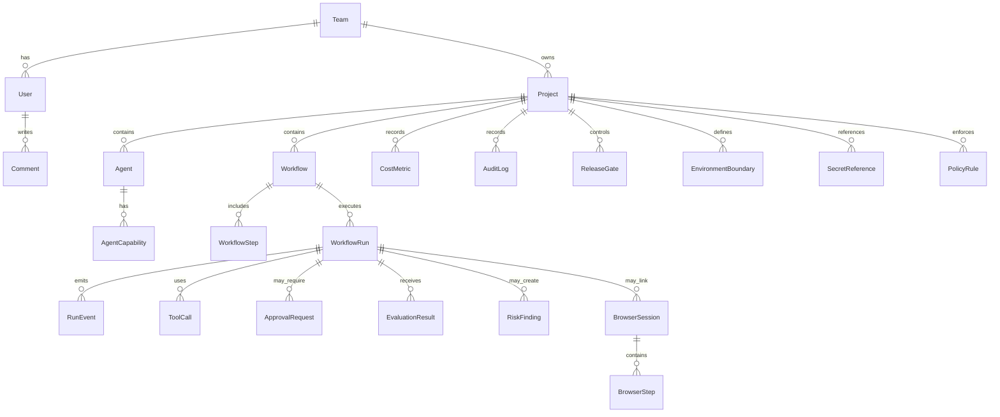

# Database Schema

## Schema Goal

The schema should support a deterministic local demo now and a future PostgreSQL backend later. The model is relational because workflow runs, tool calls, approvals, evaluations, risks, browser sessions, cost metrics, and audit logs need reliable joins, filtering, and historical traceability.

## Conceptual Entity Map

## Entity Descriptions

### User

Purpose: represents a team member or demo persona.

Key fields:

- `id`
- `teamId`
- `name`
- `email`
- `role`
- `avatarUrl`
- `status`
- `lastActiveAt`
- `createdAt`

Security considerations:

- Role is demo-state only in early phases.
- Future backend must never trust client-side role switching.
- Email should be treated as personal data.

### Team

Purpose: groups users, projects, roles, and policies.

Key fields:

- `id`
- `name`
- `plan`
- `createdAt`
- `updatedAt`

Indexes:

- `name`

Future notes:

- Multi-tenant isolation starts at team/project boundaries.

### Role

Purpose: defines built-in or future custom permission sets.

Key fields:

- `id`
- `name`
- `description`
- `isSystemRole`

Roles:

- Founder/Admin
- AI Engineer
- QA Reviewer
- Security Reviewer
- Product Manager
- Viewer

### Permission

Purpose: atomic action authorization used by RBAC and policy checks.

Key fields:

- `id`
- `key`
- `description`
- `category`

Examples:

- `agent.read`
- `agent.write`
- `workflow.publish`
- `approval.decide`
- `risk.resolve`
- `audit.read`
- `rbac.manage`

### Project

Purpose: a workspace for one AI product, team, or client automation program.

Key fields:

- `id`
- `teamId`
- `name`
- `slug`
- `environment`
- `status`
- `description`
- `createdAt`
- `updatedAt`

Indexes:

- `(teamId, slug)`
- `(teamId, status)`

### Agent

Purpose: defines an AI agent and its operating profile.

Key fields:

- `id`
- `projectId`
- `name`
- `description`
- `ownerUserId`
- `status`
- `riskLevel`
- `defaultModel`
- `lastRunAt`
- `successRate`
- `averageCostCents`
- `createdAt`
- `updatedAt`

Indexes:

- `(projectId, status)`
- `(projectId, riskLevel)`
- `ownerUserId`

### AgentCapability

Purpose: lists what an agent can do.

Key fields:

- `id`
- `agentId`
- `name`
- `category`
- `requiresApproval`
- `riskLevel`
- `toolName`

Examples:

- Browser QA
- Code review
- Documentation drafting
- Data extraction
- Release gate analysis

### Workflow

Purpose: reusable process definition made of steps, dependencies, tools, policies, and approvals.

Key fields:

- `id`
- `projectId`
- `name`
- `description`
- `status`
- `version`
- `ownerUserId`
- `triggerType`
- `createdAt`
- `updatedAt`
- `publishedAt`

Indexes:

- `(projectId, status)`
- `(projectId, version)`

### WorkflowStep

Purpose: one node in a workflow graph.

Key fields:

- `id`
- `workflowId`
- `stepKey`
- `name`
- `type`
- `dependsOnStepKeys`
- `agentId`
- `toolName`
- `approvalPolicyId`
- `retryPolicy`
- `timeoutSeconds`
- `position`

Step types:

- `trigger`
- `agent_task`
- `tool_call`
- `approval`
- `evaluation`
- `browser_qa`
- `release_gate`
- `notification`

### WorkflowRun

Purpose: one execution of a workflow.

Key fields:

- `id`
- `projectId`
- `workflowId`
- `workflowVersion`
- `triggeredByUserId`
- `status`
- `environment`
- `traceId`
- `startedAt`
- `completedAt`
- `durationMs`
- `totalCostCents`
- `failureReason`

Indexes:

- `(projectId, status, startedAt)`
- `(workflowId, startedAt)`
- `traceId`

### RunEvent

Purpose: immutable event in a run timeline.

Key fields:

- `id`
- `workflowRunId`
- `stepId`
- `eventType`
- `severity`
- `message`
- `metadata`
- `createdAt`
- `sequence`

Indexes:

- `(workflowRunId, sequence)`
- `(workflowRunId, createdAt)`
- `(eventType, severity)`

Audit requirements:

- Important because it supports deterministic replay and failure analysis.

### ToolCall

Purpose: record of a tool invocation made by an agent or workflow step.

Key fields:

- `id`
- `workflowRunId`
- `stepId`
- `agentId`
- `toolName`
- `inputSummary`
- `outputSummary`
- `status`
- `riskLevel`
- `approvalRequestId`
- `startedAt`
- `completedAt`
- `durationMs`
- `errorCode`

Security considerations:

- Store summaries in early demos, not raw sensitive payloads.
- Future backend should redact secrets and personal data.

### ApprovalRequest

Purpose: human decision point for risky, blocked, or business-impacting actions.

Key fields:

- `id`
- `projectId`
- `workflowRunId`
- `toolCallId`
- `requestedBySystem`
- `assignedRole`
- `assignedUserId`
- `status`
- `riskLevel`
- `reason`
- `decision`
- `decidedByUserId`
- `decisionComment`
- `requestedAt`
- `decidedAt`
- `expiresAt`

Indexes:

- `(projectId, status, requestedAt)`
- `assignedUserId`
- `assignedRole`

### EvaluationResult

Purpose: scored result for a workflow run or step.

Key fields:

- `id`
- `workflowRunId`
- `evaluatorType`
- `correctnessScore`
- `safetyScore`
- `reliabilityScore`
- `latencyScore`
- `costScore`
- `userImpactScore`
- `policyComplianceScore`
- `overallScore`
- `status`
- `notes`
- `createdAt`

### RiskFinding

Purpose: security, quality, policy, or operational risk discovered during a run or review.

Key fields:

- `id`
- `projectId`
- `workflowRunId`
- `toolCallId`
- `category`
- `severity`
- `status`
- `title`
- `description`
- `evidenceSummary`
- `ownerRole`
- `ownerUserId`
- `createdAt`
- `resolvedAt`

Indexes:

- `(projectId, severity, status)`
- `(category, status)`

### BrowserSession

Purpose: browser QA execution record linked to a run or release gate.

Key fields:

- `id`
- `projectId`
- `workflowRunId`
- `status`
- `targetUrl`
- `browserName`
- `viewport`
- `startedAt`
- `completedAt`
- `summary`

### BrowserStep

Purpose: one action/assertion inside a browser QA session.

Key fields:

- `id`
- `browserSessionId`
- `sequence`
- `action`
- `selectorSummary`
- `expectedResult`
- `observedResult`
- `status`
- `screenshotRef`
- `consoleIssueCount`
- `networkIssueCount`
- `accessibilityNote`

### CostMetric

Purpose: cost and token record for dashboards and budgets.

Key fields:

- `id`
- `projectId`
- `workflowRunId`
- `agentId`
- `modelName`
- `inputTokens`
- `outputTokens`
- `estimatedCostCents`
- `recordedAt`

Indexes:

- `(projectId, recordedAt)`
- `(workflowRunId)`
- `(agentId, recordedAt)`

### AuditLog

Purpose: append-only record of high-risk and administrative actions.

Key fields:

- `id`
- `projectId`
- `actorUserId`
- `action`
- `targetType`
- `targetId`
- `beforeSummary`
- `afterSummary`
- `reason`
- `correlationId`
- `createdAt`

Indexes:

- `(projectId, createdAt)`
- `(actorUserId, createdAt)`
- `(targetType, targetId)`

### Comment

Purpose: reviewer notes on approvals, risks, runs, and evaluations.

Key fields:

- `id`
- `projectId`
- `authorUserId`
- `targetType`
- `targetId`
- `body`
- `createdAt`

### Notification

Purpose: future in-app notification for assigned reviews and blocked runs.

Key fields:

- `id`
- `projectId`
- `userId`
- `type`
- `title`
- `body`
- `status`
- `createdAt`
- `readAt`

### ReleaseGate

Purpose: deploy/release readiness rule that aggregates tests, risks, approvals, and evaluation thresholds.

Key fields:

- `id`
- `projectId`
- `name`
- `status`
- `environment`
- `requiredEvaluationScore`
- `blockOnHighRisk`
- `blockOnFailedBrowserQa`
- `lastCheckedAt`

### EnvironmentBoundary

Purpose: defines what actions are allowed in demo, staging, or production-like contexts.

Key fields:

- `id`
- `projectId`
- `name`
- `environment`
- `allowedToolCategories`
- `requiresApprovalAboveRisk`
- `isProductionLike`

### SecretReference

Purpose: metadata pointer to a secret stored outside the database.

Key fields:

- `id`
- `projectId`
- `name`
- `provider`
- `scope`
- `lastRotatedAt`
- `createdAt`

Security considerations:

- Never store secret values in database rows or client data.
- Demo data should clearly mark references as mock.

### PolicyRule

Purpose: rule used to require approval, create risk findings, or block run steps.

Key fields:

- `id`
- `projectId`
- `name`
- `category`
- `condition`
- `action`
- `severity`
- `enabled`
- `createdAt`
- `updatedAt`

## Enums And Statuses

| Enum | Values |
| --- | --- |
| `ProjectStatus` | `active`, `paused`, `archived` |
| `AgentStatus` | `active`, `paused`, `needs_review`, `archived` |
| `RiskLevel` | `low`, `medium`, `high`, `critical` |
| `WorkflowStatus` | `draft`, `published`, `paused`, `archived` |
| `RunStatus` | `queued`, `running`, `waiting_for_approval`, `evaluating`, `passed`, `failed`, `rejected`, `cancelled` |
| `StepStatus` | `pending`, `running`, `waiting_for_approval`, `passed`, `failed`, `skipped`, `cancelled` |
| `ToolCallStatus` | `pending`, `running`, `waiting_for_approval`, `succeeded`, `failed`, `blocked`, `redacted` |
| `ApprovalStatus` | `pending`, `approved`, `rejected`, `expired`, `cancelled` |
| `EvaluationStatus` | `passed`, `warning`, `failed` |
| `RiskStatus` | `open`, `triaged`, `mitigated`, `accepted`, `resolved` |
| `BrowserSessionStatus` | `queued`, `running`, `passed`, `failed`, `cancelled` |
| `ReleaseGateStatus` | `passed`, `warning`, `blocked`, `not_checked` |

## Audit Strategy

The system should audit:

- Approval decisions.
- Role and permission changes.
- Workflow publication and edits.
- Agent capability changes.
- Policy rule changes.
- Secret reference changes.
- Release gate overrides.
- Risk status changes.
- Environment boundary changes.

Audit logs should be append-only in future backend phases. For the demo, audit data should be deterministic seed records that show the intended behavior.

## Data Retention Considerations

- Audit logs: long retention, especially for high-risk actions.
- Run events: medium retention, with aggregates preserved.
- Tool call summaries: retain enough for debugging, redact sensitive payloads.
- Browser screenshots: store outside the relational database in future phases.
- Cost metrics: retain aggregates for trend analysis.
- Comments and approvals: retain with audit records because they explain decisions.

## Mock Seed-Data Design

Early app phases should include deterministic seed data:

- One team: `AI Factory Demo Team`.
- One project: `AgentOps Command Center`.
- Six demo users matching the role model.
- Five to seven agents with different capabilities and risk levels.
- Four workflows with varied statuses and approval requirements.
- Ten to fifteen workflow runs with passed, failed, rejected, and waiting states.
- Realistic run events, tool calls, approvals, evaluations, risk findings, cost metrics, browser sessions, and audit logs.

Seed data should be consistent across refreshes so screenshots, testing, and case-study explanations are repeatable.
