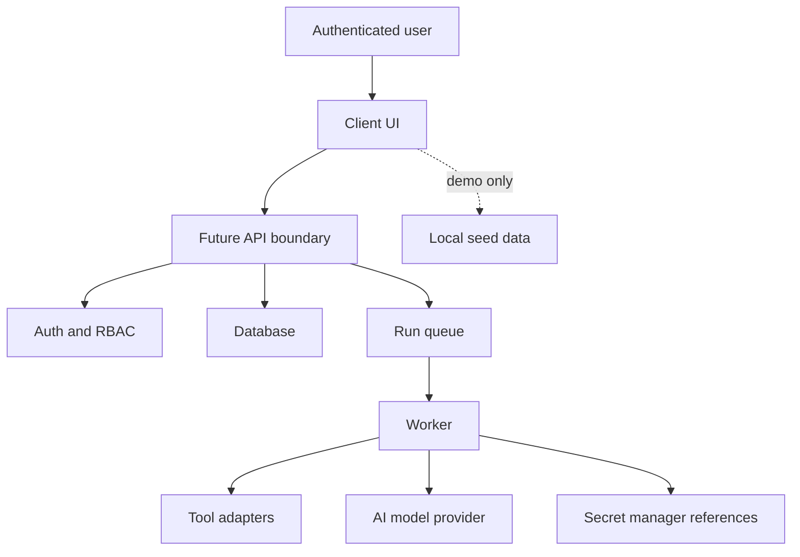

# Security Model

## Security Goal

AgentOps Command Center is designed around the idea that AI automation must be observable, permissioned, and interruptible. Even in a local demo, the product language should make clear that risky agent actions need human review, secrets are never exposed to model context, and auditability is a product requirement.

## Phase 1 Security Scope

Phase 1 is documentation only.

Mocked in Phase 1:

- Authentication.
- Role switching.
- API authorization.
- Database persistence.
- Secret references.
- Browser automation.
- Tool execution.
- AI model calls.

Not mocked as claims:

- No real production security is claimed.
- No real private accounts are connected.
- No real secrets are created.
- No real customer data exists.

## Assets

| Asset | Why It Matters |
| --- | --- |
| Agent configuration | Defines what an agent can do and which tools it may use. |
| Workflow definitions | Control execution order, approvals, and release gates. |
| Workflow run events | Provide traceability and replay evidence. |
| Tool call summaries | Show what actions were attempted and why. |
| Approval decisions | Human authorization record for risky actions. |
| Evaluation results | Quality and safety evidence. |
| Risk findings | Security, policy, and operational issues. |
| Audit logs | Accountability record for sensitive actions. |
| Secret references | Pointers to credentials that must never be exposed. |
| Team roles | Authorization boundary for all sensitive workflows. |

## Trust Boundaries

Boundaries:

- Client UI is not trusted for role enforcement.
- Future API must enforce RBAC on every write and sensitive read.
- Workers must receive scoped permissions, not global authority.
- Tool adapters must validate environment boundaries.
- Secret values stay outside the repo, UI, and model context.
- Browser automation targets must be restricted by environment policy.

## Threat Model

| Threat | Example | Control |
| --- | --- | --- |
| Unauthorized role escalation | Viewer attempts to approve a high-risk action. | Server-side RBAC, audit log, no trust in client role. |
| Prompt injection | Retrieved or browsed content tells an agent to ignore policy. | Treat external content as untrusted data, policy checks, human approval. |
| Tool injection | Tool output asks system to run another action. | Tool outputs are data, not instructions; permission gate before tool execution. |
| Secret exposure | API key appears in model prompt or tool log. | Secret references only, redaction, no raw secret values in logs. |
| Over-automation | Agent executes production-impacting action without review. | Environment boundaries, approval gates, release gates. |
| Audit tampering | Actor changes or deletes an approval record. | Append-only audit log in future backend. |
| Sensitive log leakage | Tool input contains personal data. | Summaries, redaction, role-aware detail views. |
| Replay confusion | Failed run cannot be reproduced. | Immutable run events and deterministic replay data. |
| Cost abuse | Workflow loops or repeatedly calls expensive model. | Budgets, rate limits, retry limits, cost alerts. |

## RBAC Model

Roles:

- Founder/Admin: full access.
- AI Engineer: create/edit agents and workflows, inspect runs, debug failures.
- QA Reviewer: inspect QA sessions, evaluations, release gates, and failed runs.
- Security Reviewer: inspect risks, sensitive tool calls, approvals, and audit logs.
- Product Manager: review outcomes, approve business-level decisions, comment on evaluations.
- Viewer: read-only access to selected dashboards and reports.

RBAC rules:

- Deny by default.
- Assign permissions by role.
- Future backend enforces permissions server-side.
- High-risk actions require role-specific approval.
- Role changes are audited.
- Viewer never sees raw sensitive payloads.

## Approval Gates

Approval gates should trigger when:

- Risk level is high or critical.
- A tool may affect production-like environments.
- A workflow wants to use a sensitive secret reference.
- A browser automation target is outside allowed boundaries.
- Evaluation score is below release threshold.
- A run attempts a destructive or externally visible action.
- A policy rule requires human review.

Approval decisions require:

- Reviewer identity.
- Decision.
- Comment for high or critical risk.
- Timestamp.
- Run/tool/policy context.
- Audit log record.

## Secret Handling Policy

Rules:

- Never commit secrets.
- Never store secret values in seed data.
- Never expose secrets to client-side code.
- Never place secret values in model prompts.
- Store only `SecretReference` metadata.
- Redact values in logs and screenshots.
- Rotate secret references in future backend phases.
- Require approval for adding or changing production-like secret references.

Phase 1 docs may mention mock secret references, but must not include actual keys.

## Data Privacy

Privacy expectations:

- Store reviewer-friendly summaries instead of raw sensitive data when possible.
- Keep email and user identity fields minimal.
- Redact tool inputs and outputs that may contain personal data.
- Limit audit log visibility to authorized roles.
- Define retention rules for logs, screenshots, and tool outputs.
- Make demo data clearly fictional.

## Browser Automation Safety

Future browser QA must:

- Run against allowed demo/local targets unless explicitly approved.
- Avoid logged-in private websites without permission.
- Record screenshot references, not sensitive personal pages.
- Keep console/network logs redacted.
- Avoid destructive browser actions unless intentionally modeled and approved.
- Link QA failures to release gates instead of silently ignoring them.

## Prompt Injection Awareness

Prompt injection risks can come from:

- Web pages.
- Documents.
- Tool outputs.
- User-provided instructions.
- Retrieved memory.
- Browser console or network content.

Controls:

- Separate instructions from untrusted content.
- Treat external content as data.
- Add policy checks before tool execution.
- Use risk findings for suspicious instructions.
- Require human approval for high-impact actions.
- Keep model decisions traceable through run events.

## Tool Injection Awareness

Tool outputs should never be allowed to issue new instructions by themselves.

Future controls:

- Tool registry with allowed inputs and outputs.
- Schema validation.
- Permission gate before execution.
- Environment boundary checks.
- Audit records for sensitive tools.
- Human approval for high-risk actions.

## Rate Limiting And Backend Controls

Future backend should include:

- Per-user and per-team request limits.
- Per-workflow run limits.
- Retry limits with backoff.
- Cost budgets by project and workflow.
- Queue concurrency limits.
- API request validation.
- Structured error codes.
- Abuse detection for repeated failed approvals or run starts.

## Environment Isolation

Environment boundaries:

- `demo`: deterministic local demo, no external effects.
- `development`: local or non-sensitive development.
- `staging`: production-like test environment with stricter controls.
- `production`: future environment, requires strongest approval and audit rules.

High-risk actions in production-like environments should require explicit approval from Admin or the configured reviewer role.

## Security Checklist

- [ ] No secrets committed.
- [ ] No `.env` file created in Phase 1.
- [ ] RBAC documented before implementation.
- [ ] Approval gates defined for high-risk actions.
- [ ] Audit log requirements documented.
- [ ] Secret references modeled without values.
- [ ] Prompt injection and tool injection risks documented.
- [ ] Browser automation safety rules documented.
- [ ] Future API writes require server-side authorization.
- [ ] Release gates block unresolved high/critical risks.

## Phase 3A Connector And Owner-Control Security

Phase 3A extends the threat model with connector and setup concepts, but it does not implement real enforcement.

Rules:

- Agent connectors are deny-by-default.
- Public demo uses allowlisted local/demo targets only.
- Connector secret values never appear in client data or docs.
- Future connector tokens must be backend-only and hashed.
- Native Protocol events must be schema-validated before persistence.
- MCP/tool connector output must be treated as data, not instructions.
- External agent events must be attributable by connector, project, trace, and actor reference.
- Customers can configure workspace targets and connectors only within plan and policy limits.
- Customers cannot modify owner-only platform controls.
- Owner-only settings require future server-side authorization and audit logs.
- Self-hosted/source distribution cannot fully prevent reverse engineering; hosted SaaS or controlled licensed packages are safer.

## Security Acceptance Criteria

- A reviewer can explain who can approve each risky action.
- Every sensitive write has an audit requirement.
- Secret handling is clear and does not rely on client trust.
- The docs distinguish demo behavior from real production security.
- Future implementation has clear security tests to add.
