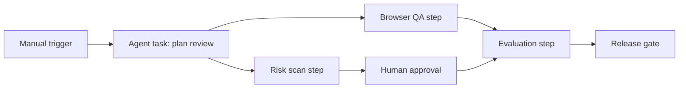
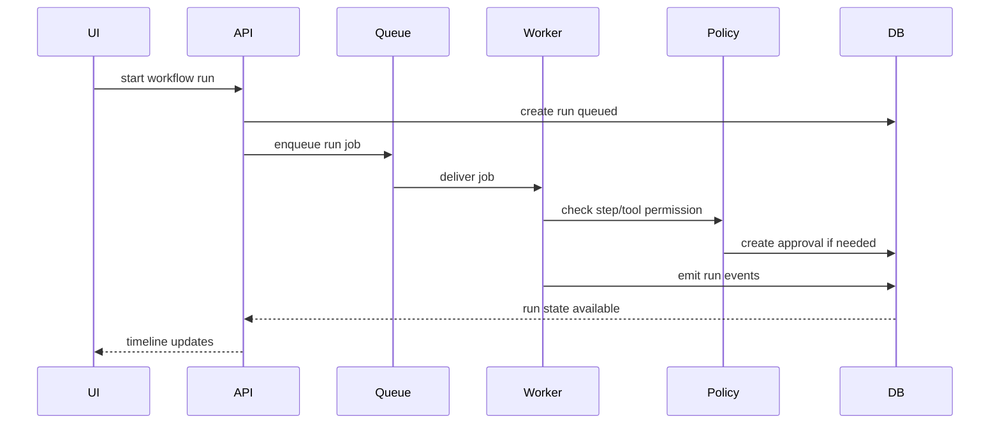

# Workflow Engine Design

## Design Goal

The workflow engine should model AI automation as a controlled graph of steps rather than a loose sequence of prompts. The early demo can simulate this with deterministic data, while the future backend can execute the same model through queues, workers, policy checks, and live event streams.

## Workflow Graph Model

A workflow is a directed acyclic graph:

- Nodes are workflow steps.
- Edges are dependencies.
- Each step has a type, owner context, status, retry policy, and optional approval policy.
- A run emits events as steps start, complete, fail, pause, or resume.



## Step Types

| Step Type | Purpose |
| --- | --- |
| `trigger` | Starts a workflow from manual action, schedule, webhook, or future event. |
| `agent_task` | Invokes an agent to perform a scoped task. |
| `tool_call` | Executes a specific tool through the permission gate. |
| `approval` | Pauses execution until a human decides. |
| `evaluation` | Scores the run or step output. |
| `browser_qa` | Records browser test steps and results. |
| `release_gate` | Aggregates conditions and blocks or passes release readiness. |
| `notification` | Future user notification or external message. |

## Dependency Model

Rules:

- A step can run only after required dependencies pass.
- Failed required dependencies fail or skip downstream steps.
- Optional dependencies can create warnings instead of failure.
- Cycles are invalid.
- Each step has a stable `stepKey` so run events remain understandable across versions.
- Published workflow versions should be immutable.

Validation checks:

- No missing `dependsOnStepKeys`.
- No cycles.
- No duplicate step keys.
- Tool steps reference allowed tools.
- Approval steps reference valid policy rules.
- Release gates reference valid evaluation/risk/browser QA inputs.

## Human Approval Checkpoints

Approval checkpoints can occur:

- Before a sensitive tool runs.
- After an agent proposes an action.
- When a policy rule detects high risk.
- Before a production-like environment action.
- When a release gate override is requested.

Approval context should include:

- Proposed action.
- Risk level.
- Evidence summary.
- Related tool call.
- Related run event.
- Required reviewer role.
- Expiration policy.
- Decision comment.

## Retry And Failure Strategy

Retry rules:

- Retry only known retryable failures.
- Do not retry rejected approvals.
- Do not retry policy-blocked actions without configuration change.
- Record each attempt as a run event.
- Keep the failed attempt visible.
- Include retry count in timeline UI.

Failure handling:

- Fail fast for critical policy violations.
- Pause for approval when policy allows human review.
- Continue with warning only for configured non-blocking issues.
- Create risk findings for security or governance issues.
- Update release gate status when failures affect readiness.

## Event Timeline Model

Timeline event types:

- `run_queued`
- `run_started`
- `step_started`
- `tool_call_started`
- `tool_call_completed`
- `tool_call_failed`
- `approval_requested`
- `approval_approved`
- `approval_rejected`
- `risk_detected`
- `browser_step_completed`
- `evaluation_completed`
- `release_gate_checked`
- `run_completed`
- `run_failed`

Event fields:

- `id`
- `workflowRunId`
- `stepId`
- `eventType`
- `severity`
- `message`
- `metadata`
- `sequence`
- `createdAt`

## Deterministic Simulation Model

Early app phases should not execute real agents. They should simulate workflows by reading seeded run data and presenting it as if it were an event-sourced timeline.

Simulation rules:

- No random statuses.
- No hidden external calls.
- Seed data controls all outcomes.
- UI actions such as approve/reject update local state and append mock audit events.
- Failure replay reads from static event sequences.
- Costs and scores are plausible but clearly demo values.

Example simulated workflow:

```json
{
  "workflowId": "workflow_release_review",
  "version": 1,
  "steps": [
    {
      "stepKey": "browser_qa",
      "type": "browser_qa",
      "dependsOnStepKeys": []
    },
    {
      "stepKey": "risk_scan",
      "type": "agent_task",
      "dependsOnStepKeys": []
    },
    {
      "stepKey": "security_approval",
      "type": "approval",
      "dependsOnStepKeys": ["risk_scan"]
    },
    {
      "stepKey": "release_gate",
      "type": "release_gate",
      "dependsOnStepKeys": ["browser_qa", "security_approval"]
    }
  ]
}
```

## Future Queue And Worker Architecture

Future execution path:

1. API validates request and RBAC.
2. API creates a queued `WorkflowRun`.
3. Queue receives a run execution job.
4. Worker loads workflow version and environment boundary.
5. Worker executes steps in dependency order.
6. Worker emits run events.
7. Policy gate creates approval requests when needed.
8. Worker pauses until approval decision.
9. Evaluator scores outputs.
10. Release gate checks blockers.
11. API streams run events to clients.



## Future WebSocket Or Live Update Model

The future UI can receive updates through:

- WebSocket channel per project/run.
- Server-sent events for simpler one-way timeline streaming.
- Polling fallback for low-complexity demos.

Events should be:

- Ordered by sequence.
- Idempotent by event ID.
- Scoped to authorized project and role.
- Redacted based on permissions.

## Workflow Engine Acceptance Criteria

- Workflow graph validation is documented before implementation.
- Step, run, tool, approval, evaluation, and gate states are aligned.
- Simulation can work without external services.
- Future queue/worker architecture is clear.
- Approval checkpoints are first-class workflow nodes.
